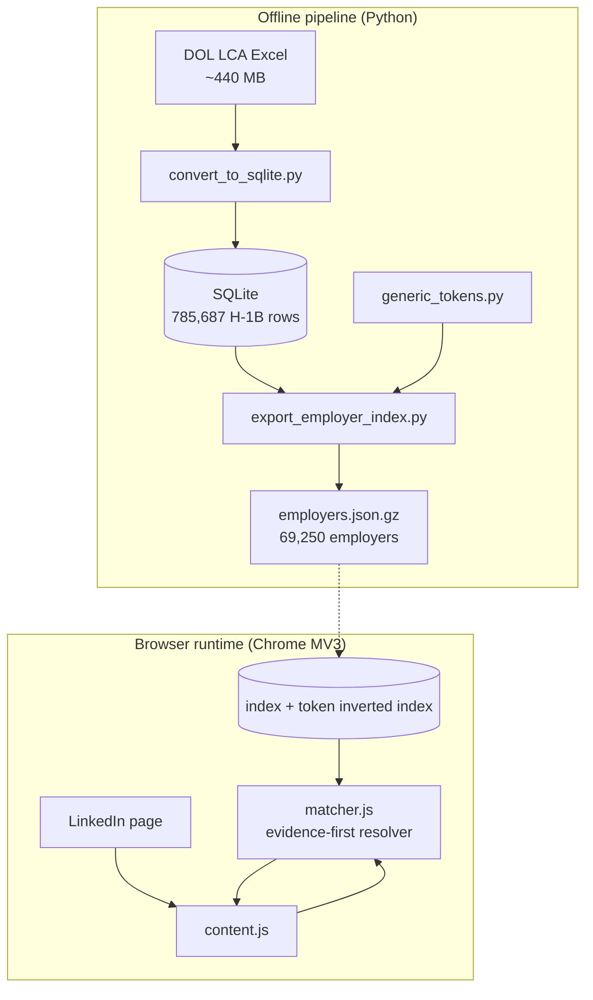
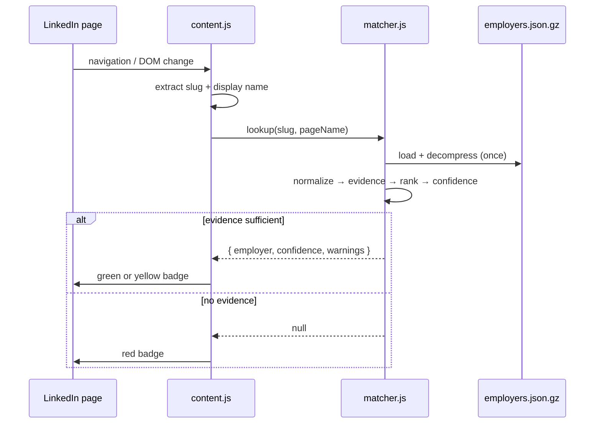
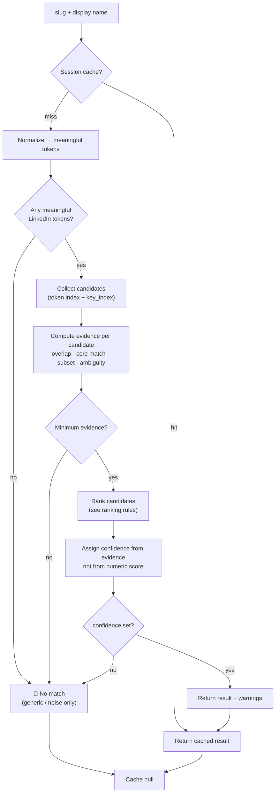
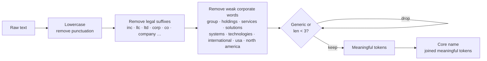
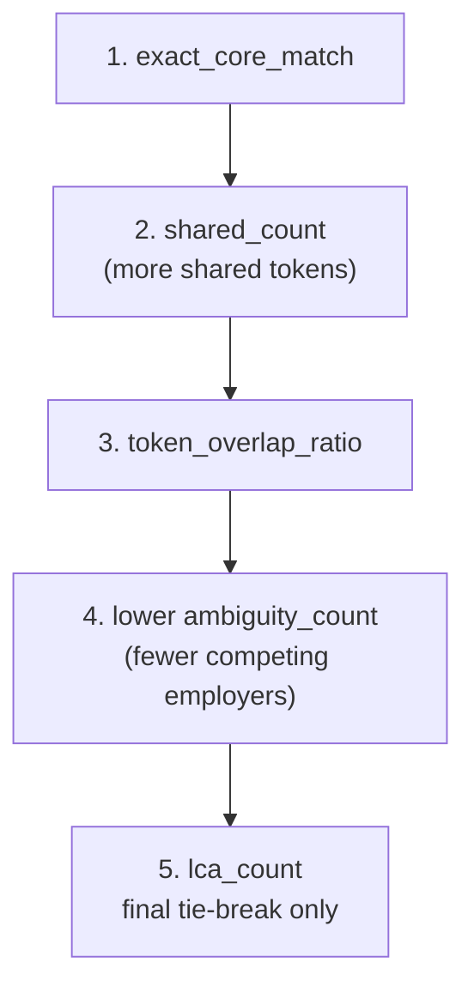
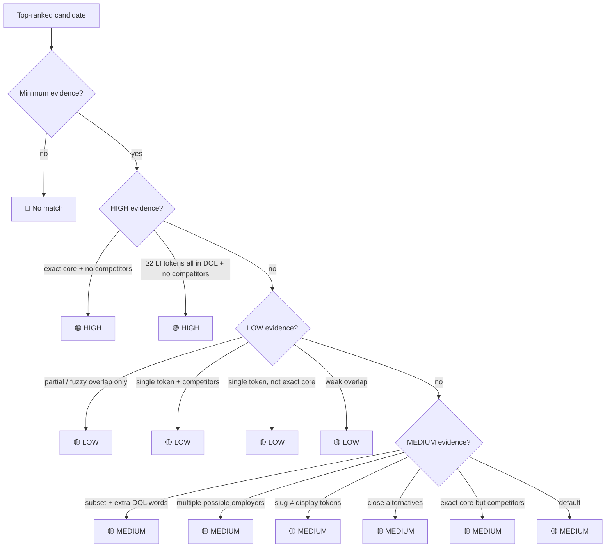
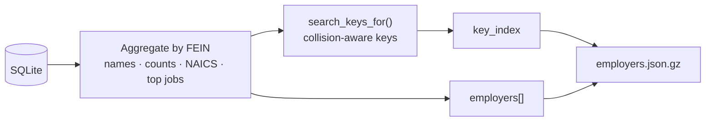
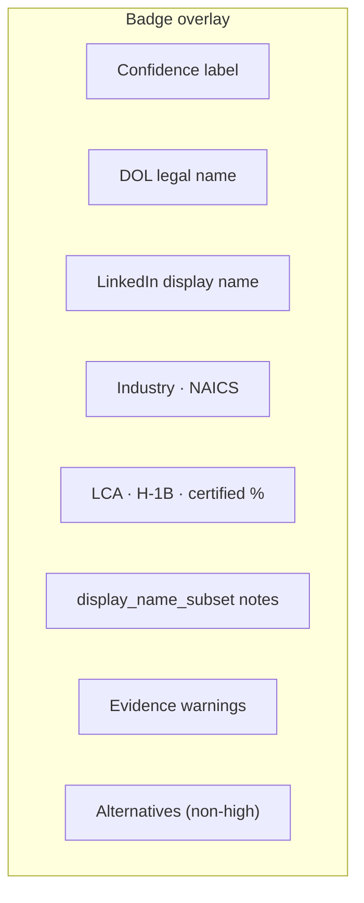

# LCA Sponsor Checker

Cross-reference LinkedIn company pages against U.S. Department of Labor (DOL) H-1B Labor Condition Application (LCA) disclosure data — fully offline, no backend.

LinkedIn exposes a **URL slug** and a **display name**. DOL records use **legal entity names** and **FEINs**. There is no shared identifier between the two systems, so matching is an **entity resolution** problem: normalize both sides, collect **evidence**, rank candidates, and assign rule-based **confidence** on the badge.

**Data:** DOL LCA Disclosure · FY2026 Q2 · 785,687 H-1B filings · 69,250 employers (by FEIN)  
**Extension:** Chrome Manifest V3 · **v1.6.1** · index **v1.3**

### Badge meanings

| Badge | Confidence | Meaning |
|-------|------------|---------|
| 🟢 **Green** | `high` | Likely the **same legal employer** appears in DOL LCA data |
| 🟡 **Yellow** | `medium` or `low` | **Possible match** — verify legal name and industry manually |
| 🔴 **Red** | no result | **No reliable match** found in the index |

**Confidence is entity-resolution confidence, not sponsorship probability.** Green or yellow does **not** predict whether this specific job posting sponsors H-1B.

The matcher is **evidence-first**, not score-first. There are no user-facing numeric match scores and no mapping like “score ≥ 90 → green.” Token count alone does not imply a better entity match.

---

## Quick start

### Use the extension (pre-built index included)

The repo ships `extension/data/employers.json.gz`. You only need Chrome — no Python, no server.

```bash
git clone https://github.com/nicole732470/lca-linkedin-checker.git
cd lca-linkedin-checker
```

1. Open `chrome://extensions`
2. Enable **Developer mode** (top right)
3. Click **Load unpacked** → select the `extension/` folder
4. Visit any [LinkedIn company page](https://www.linkedin.com/company/) or job posting

### Rebuild the index from DOL data (optional)

Download the latest [LCA Disclosure Data](https://www.dol.gov/agencies/eta/foreign-labor/performance) Excel file and place it in `data-pipeline/` (default: `LCA_Dislclosure_Data_FY2026_Q2.xlsx`). Then:

```bash
python3 -m venv .venv
source .venv/bin/activate          # Windows: .venv\Scripts\activate
pip install -r data-pipeline/requirements.txt

cd data-pipeline
python3 convert_to_sqlite.py       # Excel → lca_fy2026_q2.db (~1 min)
python3 export_employer_index.py   # SQLite → ../extension/data/employers.json.gz
```

Reload the extension on `chrome://extensions` after re-exporting.

**Smoke-test slugs:**

```bash
cd data-pipeline
python3 export_employer_index.py --test microsoft
python3 test_entity_resolution.py
```

---

## System architecture



No remote API. No `chrome.storage`. Session cache is a **performance optimization only** — it is not a source of truth and does not affect confidence.

---

## Runtime flow



---

## Entity resolution pipeline (evidence-first)



Every candidate — including `key_index` hits — must pass the same evidence and confidence pipeline. A precomputed key hit alone never forces green.

---

## Normalization

Python (`export_employer_index.py`) and JavaScript (`matcher.js`) share token lists via `generic_tokens.py`.



### Legal suffixes removed anywhere

`inc`, `incorporated`, `llc`, `ltd`, `limited`, `corp`, `corporation`, `co`, `company`, `llp`, `lp`, `plc`

### Weak corporate words removed anywhere

`group`, `holdings`, `services`, `solutions`, `systems`, `technologies`, `international`, `usa`, `us`, `america`, `north america`

### Generic tokens (cannot form a match alone)

`american`, `global`, `consulting`, `university`, `hiring`, `staffing`, … — full list in `generic_tokens.py`

### LinkedIn token selection

Display-name tokens are primary. Slug tokens are added only when not dominated by a display-name token (e.g. `tencentglobal` is ignored when display name already yields `tencent`).

---

## Evidence signals

For each candidate employer the matcher computes **evidence**, not a user-facing score:

| Signal | Definition |
|--------|------------|
| `exact_core_match` | normalized core LinkedIn name **equals** normalized core DOL name |
| `subset_match` | every LinkedIn meaningful token appears in DOL tokens |
| `shared_count` | number of shared meaningful tokens |
| `token_overlap_ratio` | shared ÷ LinkedIn meaningful tokens |
| `reverse_overlap_ratio` | shared ÷ DOL meaningful tokens |
| `single_token_match` | LinkedIn has exactly one meaningful token |
| `ambiguity_count` | employers in the index sharing **all** LinkedIn meaningful tokens |
| `close_alternatives` | other candidates with similar overlap |
| `display_name_subset` | LinkedIn display tokens ⊂ DOL legal tokens (informational note only) |
| `slug_display_disagree` | slug and display name yield different meaningful token sets |

The code does **not** infer “brand name” status. `display_name_subset` only describes text overlap — it does not promote confidence by itself.

### Minimum evidence (required to show any result)

- at least one shared meaningful token, **and**
- one of: `exact_core_match`, `subset_match`, multi-token overlap ≥ 50%, or a single shared distinctive token

Otherwise → **red** (no match).

---

## Candidate ranking

Candidates are sorted by **evidence quality**. `rank_score` exists internally for debugging/sorting only and is **never shown in the UI**. It is **not** confidence and **not** a probability.



`lca_count` is **not** evidence that names match — it only breaks ties after name evidence is equal.

---

## Confidence assignment

Confidence is derived **only from evidence rules**. When uncertain, the system prefers **yellow over green**.



### Confidence rules

| Level | Badge | Evidence required |
|-------|-------|-------------------|
| **high** | 🟢 | `exact_core_match` with no competing employers; **or** ≥ 2 LinkedIn meaningful tokens all in DOL with full overlap and no close alternatives |
| **medium** | 🟡 | Multi-token subset but DOL has extra meaningful words; exact/strong match with multiple possible entities; slug and display disagree; close alternatives exist |
| **low** | 🟡 | Single-token match; partial/fuzzy overlap only; weak overlap; only one of several LinkedIn tokens matched |
| **no match** | 🔴 | Only generic/noise tokens; no meaningful overlap; below minimum evidence |

### Examples

| LinkedIn | DOL match | Confidence | Why |
|----------|-----------|------------|-----|
| `microsoft` / Microsoft | Microsoft Corporation | **high** | Exact core, unique token |
| `ornua-foods-north-america-inc` / Ornua | Ornua Foods North America, Inc. | **high** | Multi-token subset, no competitors |
| `eversana` / Eversana | EVERSANA LIFE SCIENCE SERVICES, LLC | **high** | Exact core on a distinctive token, no competitors; warns DOL legal name has extra words |
| `meta` / Meta | META IT CORP (top of 12) | **low** | Single ambiguous token shared by many employers |
| `tencentglobal` / Tencent | Tencent America LLC | **low** | Single token, multiple employers |
| `a-hiring-company` / A Hiring Company | — | **no match** | `hiring` is generic |

### Warnings (informational; shown on badge)

| Warning | Trigger |
|---------|---------|
| Single distinctive word | `single_token_match` |
| Multiple employers | `ambiguity_count > 1` |
| Slug ≠ display name | `slug_display_disagree` |
| Display vs legal mismatch | display/legal overlap < 34% |
| Extra DOL words | meaningful tokens on DOL not on LinkedIn |
| Partial overlap only | method `token_overlap` or `key_overlap` |
| Very few LCA filings | `lca_count ≤ 2` |
| Other possible matches | close alternatives and confidence ≠ `high` |

### What is explicitly **not** in the matcher

| Removed / de-emphasized | Why |
|-------------------------|-----|
| Numeric score → green mapping (70 / 85 / 90 / 95) | Token count is not match quality |
| `manual_override` as confidence path | No manual verification in automatic mode |
| `learned_slug` as high confidence | Session cache only; not a source of truth |
| `brand_subset` | Renamed to `display_name_subset`; overlap note only, not a confidence boost |

Implementation: `extension/lib/matcher.js` — `meaningfulTokens()`, `computeSignals()`, `assignConfidence()`, `compareCandidates()`.

---

## Index export architecture



### Search key policy (index v1.3)

- **Always index:** multi-word legal names and hyphenated slugs
- **Conditionally index:** short distinctive tokens (≥ 4 chars) when ≤ 5 employers share them
- **Never index alone:** generic words (`gamma`, `hiring`, `global`, `university`, …)

`key_index` seeds candidates at runtime; confidence still comes from evidence rules above.

### Index fields

| Field | Purpose |
|-------|---------|
| `fein` | Stable legal-entity key |
| `name` / `names[]` | Primary and alias employer names |
| `search_keys[]` | Precomputed lookup keys |
| `lca_count`, `h1b_count`, `certified_count` | Volume signals on badge (not match evidence) |
| `naics_code`, `naics_sector` | Industry context |
| `top_jobs[]` | Top 3 filed roles |
| `key_index` | `normalized_key → fein` |

---

## Repository layout

```
.
├── extension/                 # Chrome MV3 sponsorship checker (entry point)
│   ├── manifest.json          # v1.6.1 · no permissions
│   ├── content.js             # badge UI
│   ├── lib/matcher.js         # evidence-first resolver
│   └── data/employers.json.gz
├── data-pipeline/             # offline DOL LCA → employer index (Python)
│   ├── convert_to_sqlite.py
│   ├── export_employer_index.py
│   ├── generic_tokens.py
│   ├── naics_sectors.py
│   └── test_entity_resolution.py
├── backend/                   # FastAPI + agent orchestration (new product)
├── evals/                     # golden set + evaluation harness
├── data/                      # CSV exports (optional)
└── docs/
```

> **Note:** This repo is evolving from a standalone Chrome extension into an
> agentic Job Intelligence Platform. The `extension/` + `data-pipeline/` layers
> are the existing, production foundation; `backend/` and `evals/` are the new
> product surface. See **[`docs/DESIGN.md`](docs/DESIGN.md)** for the full design
> and the 8-week implementation plan, and `backend/README.md` for the build phases.

---

## Layer 1: Ingestion (Excel → SQLite)

| Decision | Rationale |
|----------|-----------|
| **python-calamine** | Fast Excel read (~47 s) |
| **SQLite** | Portable indexed storage |
| **FEIN dedup** | 79,492 names → 69,250 legal entities |

---

## Layer 2: Index export (SQLite → JSON)

| Metric | Value |
|--------|-------|
| Employers | 69,250 |
| Search keys | 202,254 |
| Gzip (shipped) | ~6.9 MB |

---

## Layer 3: Chrome extension

| Component | Role |
|-----------|------|
| `content.js` | Extract slug/name; render badge with confidence, warnings, alternatives |
| `matcher.js` | Evidence-first entity resolution; session cache |
| `employers.json.gz` | Offline index |

**Permissions:** none. No telemetry. No remote API.

### Badge UI



---

## Data provenance

| Attribute | Value |
|-----------|-------|
| Source | DOL OFLC — LCA Disclosure Data |
| Period | FY2026 Q2 |
| H-1B LCA records | 785,687 |
| Unique employers (FEIN) | 69,250 |

LCA filings are employer attestations of intent to employ H-1B workers — not confirmed hires or lottery outcomes.

---

## Technology stack

| Layer | Technology |
|-------|------------|
| Ingestion | python-calamine · SQLite 3 |
| Index | JSON + gzip · `DecompressionStream` |
| Extension | Chrome Manifest V3 |
| Matching | Meaningful-token evidence · rule-based confidence · no ML |

---

## License

MIT — DOL public data subject to federal open-data terms.
