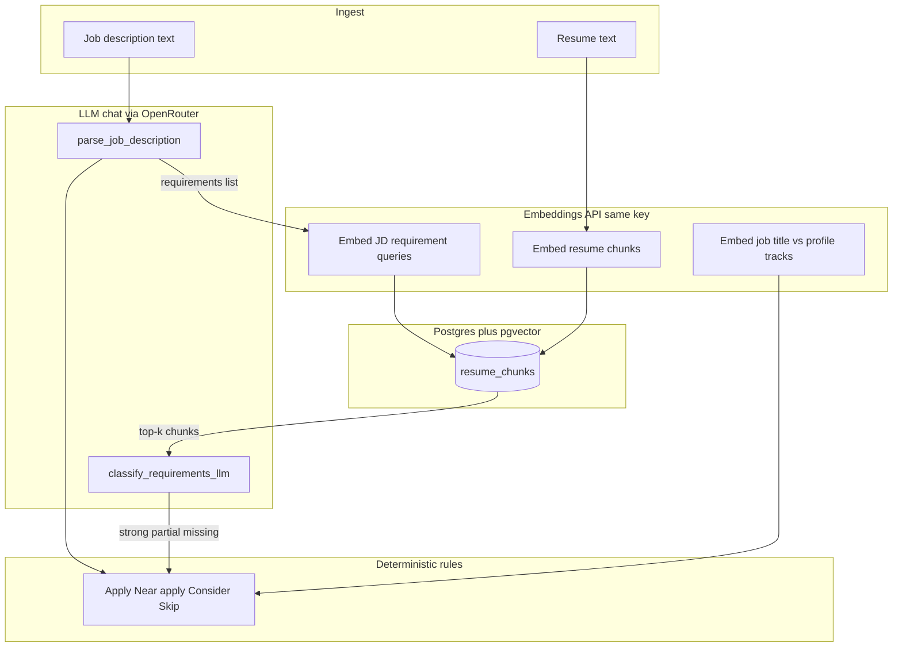
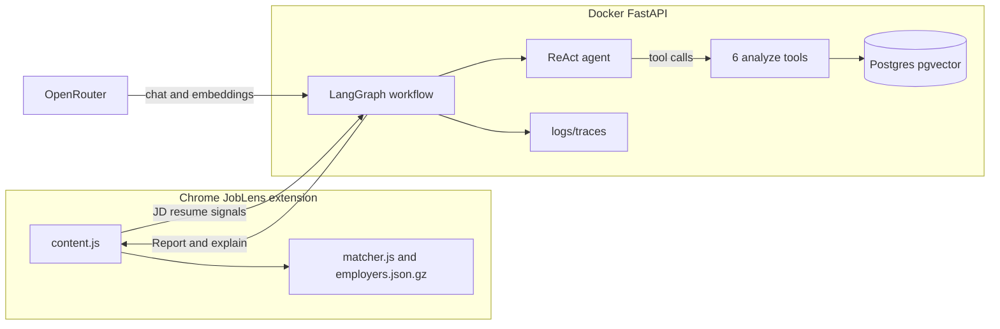
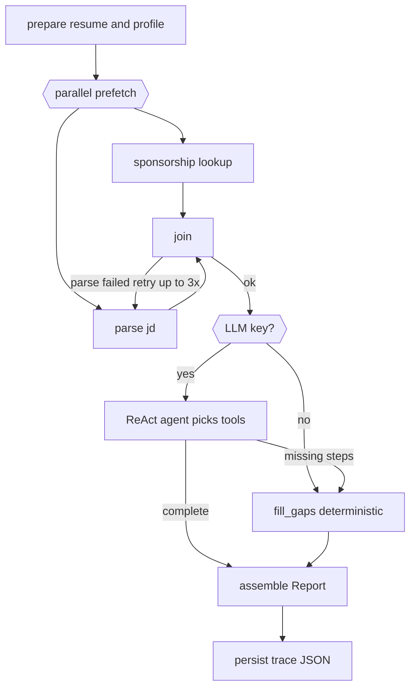

# JobLens — See a company before you apply.

Chrome extension + FastAPI backend for **evidence-based job decisions** on LinkedIn: DOL H-1B employer lookup (offline) and **Apply / Near apply / Consider / Skip** from your profile, JD, and resume.

> Product: **JobLens** · Repo: [`joblens`](https://github.com/nicole732470/joblens) · Extension v3.0+

---

## What this project is for

JobLens is a **real product** (LinkedIn panel) and an **AI-engineering portfolio**:

| Goal | What you demonstrate |
|------|----------------------|
| **Product** | H-1B entity resolution + job-fit verdict on every posting |
| **RAG** | Resume chunked → pgvector → retrieve evidence per JD requirement |
| **LLM** | Structured JD parse + **LLM judgment** of resume fit (not distance-only) |
| **Agents** | **LangGraph** (parallel prefetch, retry, conditional routing) + **ReAct tool-calling agent** |
| **Eval** | Golden set + `run_eval.py` for regression |

**Deferred (by design):** MCP server.

---

## Vector vs LLM — how they work together

This is the core mental model. **Embeddings and LLM chat solve different problems.**



| Step | Technology | Why |
|------|------------|-----|
| **JD → requirements[]** | **LLM** structured JSON | Free-text JD → typed list with quotes |
| **Resume → chunks** | Heuristic chunker | Section-aware splits |
| **Chunks → vectors** | **Embedding API** | Semantic search index in pgvector |
| **Requirement → evidence** | **Vector search** (RAG) | Find the *right paragraphs* to read — cheap, fast |
| **Evidence → strong/partial/missing** | **LLM** | Judgment call — "does this resume actually satisfy this req?" |
| **Title ↔ track (Role P)** | **Embedding** similarity | Semantic match without keyword lists |
| **Final verdict** | **Rules** on fit counts + profile | Explainable thresholds (see `docs/FIT_THRESHOLDS.md`) |

**Fallback:** if `LLM_API_KEY` is missing or LLM classify fails, resume fit uses **vector distance thresholds only** (`match_method: vector`). Set `RESUME_FIT_METHOD=vector` to force that path.

**Your OpenRouter key powers both:** chat completions (parse + classify) and embeddings (`text-embedding-3-small`).

---

## What you see on LinkedIn

| Layer | Source |
|-------|--------|
| **H-1B pill** | Extension offline (`employers.json.gz`) — no backend |
| **Verdict** | Backend — never from H-1B alone |
| **Fit grid** | Role · Resume · Location · Company · Preferences · Dealbreakers |
| **Hover tooltips** | Structured reasoning per metric |
| **Explain JSON** | `POST /analyze` → `explain` (pipeline trace, `match_method`, flags) |

Profile rules: [`evals/golden_set/candidate_profile.yaml`](evals/golden_set/candidate_profile.yaml)

---

## Quick start

### 1. Extension (H-1B offline)

```bash
git clone https://github.com/nicole732470/joblens.git
cd joblens
```

Chrome → `chrome://extensions` → Developer mode → **Load unpacked** → `extension/`

### 2. Backend (fit analysis)

```bash
cp .env.example .env
# Required: LLM_API_KEY from https://openrouter.ai
docker compose up -d --build
curl http://localhost:8000/health
```

Expected health:

```json
{
  "status": "ok",
  "database": "connected",
  "llm": "configured",
  "resume_fit_method": "auto",
  "orchestration": "langgraph-react",
  "langsmith": false,
  "trace_dir": "logs/traces"
}
```

Reload extension. Panel calls `http://localhost:8000/analyze`.

### 3. Evaluation

```bash
cd evals && python3 run_eval.py
```

---

## Architecture



### `/analyze` pipeline (LangGraph)



**ReAct agent** (`create_react_agent`) binds 6 tools. The LLM chooses call order; each tool writes results to an **artifacts cache** (keyed by `run_id`). If the agent skips a step or there is no API key, **`fill_gaps`** runs the same tools in fixed order.

**Tools:** `lookup_h1b_sponsorship`, `parse_jd_structured`, `score_resume_against_jd`, `score_company_fit`, `assess_job_risks`, `recommend_apply_skip`.

Each step records `duration_ms` in `explain.observability.steps`. Full run JSON: `logs/traces/{run_id}.json`.

### Tool API + observability

```bash
curl http://localhost:8000/tools
curl http://localhost:8000/observability/traces
curl http://localhost:8000/observability/traces/{run_id}
```

Optional **LangSmith**: set `LANGCHAIN_API_KEY` in `.env` — tracing auto-enables at startup.

*(MCP wrapper not implemented — not required for JobLens.)*

---

## API routes

| Route | Purpose |
|-------|---------|
| `GET /health` | DB, profile, LLM, orchestration status |
| `POST /analyze` | Full job report (extension calls this) |
| `GET /candidate-profile` | Loaded YAML profile (debug) |
| `POST /resume/index` | Chunk + embed resume into pgvector |
| `GET /tools` | List ReAct / analyze tools |
| `POST /tools/{name}` | Invoke one tool directly (debug) |
| `GET /observability/traces` | List recent analyze traces |
| `GET /observability/traces/{run_id}` | Full trace JSON for one run |

---

## H-1B (extension, offline)

LinkedIn company name ≠ DOL legal name. The extension matches against `employers.json.gz` **before** calling the backend.

| Pill | Meaning |
|------|---------|
| **H-1B sponsor** | Strong entity match or high filing volume |
| **Likely / Possible sponsor** | Weaker name evidence — verify manually |
| **No H-1B record** | No reliable DOL match |

Implementation: [`extension/lib/matcher.js`](extension/lib/matcher.js). Rebuild index: [`data-pipeline/`](data-pipeline/).

**Important:** H-1B only answers “does this company file?” — **never** drives Apply/Skip.

---

## Glossary (terms in this repo)

| Term | Meaning |
|------|---------|
| **RAG** | Retrieve resume chunks by vector similarity, then judge fit |
| **Embedding / vector** | Numeric representation of text meaning; used for search |
| **LLM** | Chat model — parses JD, classifies resume fit, drives ReAct agent |
| **LangGraph** | Orchestrates `/analyze` as nodes with branching and retries |
| **ReAct** | LLM loop that **reasons** then **calls tools** |
| **Tool** | One function the agent can invoke (parse JD, score resume, …) |
| **Artifacts** | Cached intermediate results per analyze run (`run_id`) |
| **fill_gaps** | Deterministic fallback if ReAct skips steps |
| **Trace** | Per-run log (`logs/traces/*.json`) with step timings |
| **Golden set** | Labeled JDs in `evals/golden_set/` for regression eval |
| **Profile** | Your rules in `candidate_profile.yaml` (tracks, dealbreakers, …) |

---

## Where data lives

| Data | Location | Cloud? |
|------|----------|--------|
| H-1B index | `extension/data/employers.json.gz` | No — bundled |
| Resume vectors | Docker volume `pgdata` | No — local Postgres |
| Profile / golden set | `evals/golden_set/` in repo | Git only |
| LLM / embeddings | OpenRouter API | External API; no AWS needed |

---

## Repository layout

```
.
├── extension/              # JobLens Chrome MV3
├── backend/
│   ├── app/
│   │   ├── graph/          # LangGraph workflow
│   │   ├── tools/          # JD parse, RAG, LLM fit, recommendation, tools
│   │   └── main.py         # FastAPI routes
│   └── tests/              # Unit tests (run: cd backend && pytest tests/)
├── evals/                  # Golden set + run_eval.py
├── data-pipeline/          # DOL Excel → employers.json.gz
├── docs/                   # Design, thresholds, report schema
├── logs/traces/            # Per-run analyze JSON (gitignored except .gitkeep)
└── docker-compose.yml
```

---

## Configuration (`.env`)

| Variable | Purpose |
|----------|---------|
| `LLM_API_KEY` | OpenRouter (chat + embeddings) |
| `LLM_MODEL` | JD parse model (default free tier) |
| `EMBEDDING_MODEL` | `openai/text-embedding-3-small` |
| `RESUME_FIT_METHOD` | `auto` \| `llm` \| `vector` |
| `TRACE_DIR` | Where `/analyze` trace JSON is written |
| `LANGCHAIN_API_KEY` | Optional LangSmith tracing |
| `DATABASE_URL` | Postgres for pgvector + H-1B index |

---

## Verdict tiers (rule-based)

| Verdict | Rule summary |
|---------|----------------|
| **Apply** | ≥2 strong matches AND fit ratio ≥ 50% |
| **Near apply** | P1–P2 track, title sim ≥ 0.30, fit ≥ 22%, below Apply bar |
| **Consider** | fit ≥ 28% or enough partial/weak touches |
| **Skip** | P4+ track, dealbreakers, avoid track, HPC penalty, or low fit |

Details: [`docs/FIT_THRESHOLDS.md`](docs/FIT_THRESHOLDS.md)

---

## Documentation

| Doc | Contents |
|-----|----------|
| [`docs/DESIGN.md`](docs/DESIGN.md) | Product goals, original architecture plan |
| [`docs/FIT_AND_RECOMMENDATION.md`](docs/FIT_AND_RECOMMENDATION.md) | Profile model, recommendation logic |
| [`docs/FIT_THRESHOLDS.md`](docs/FIT_THRESHOLDS.md) | Numbers → labels (fit ratio, Role P, …) |
| [`docs/REPORT_SCHEMA.md`](docs/REPORT_SCHEMA.md) | `/analyze` JSON shape |
| [`evals/golden_set/README.md`](evals/golden_set/README.md) | How to label golden set CSV |
| [`backend/README.md`](backend/README.md) | Backend layout (API-focused) |

---

## Debug

1. Hover metric cells in the JobLens panel (Resume shows **LLM + RAG** vs **Vector only**)
2. Console: `__jobLensLastReport.explain`
3. Network → `POST /analyze` → check `explain.resume_fit.match_method`, `explain.observability.steps`
4. Traces: `curl http://localhost:8000/observability/traces` (only after a successful analyze)
5. `curl http://localhost:8000/health`

---

## Tests

```bash
cd backend && python -m pytest tests/ -q
```

| File | Covers |
|------|--------|
| `tests/test_resume_fit.py` | Vector fallback path |
| `tests/test_recommendation_skip.py` | P4 → Skip |
| `tests/test_profile_signals.py` | Onsite / location |
| `tests/test_role_priority.py` | Penalties, title keywords |
| `tests/test_dealbreakers.py` | Dealbreaker matching |

Golden-set eval (needs running backend + LLM): `cd evals && python3 run_eval.py`

---

## Production (AWS)

Shortest path after a clean AWS account:

1. **Push** latest `main` to [github.com/nicole732470/joblens](https://github.com/nicole732470/joblens)
2. **RDS** — PostgreSQL 16 (`db.t4g.micro`), database `joblens`, SG allows 5432 from EC2 only  
   `psql "$DATABASE_URL" -f deploy/rds-init.sql` (pgvector + `resume_chunks`)
3. **EC2** — `t3.small`, elastic IP, SG open 443 (and 8000 temporarily for debug)  
   `./deploy/ec2-bootstrap.sh` → clone repo → copy `.env.example` → `.env`
4. **Backend** — `docker compose -f docker-compose.prod.yml up -d --build`  
   `curl http://127.0.0.1:8000/health`
5. **HTTPS** — A record `api.joblens.app` → elastic IP; host Caddy with [`deploy/Caddyfile`](deploy/Caddyfile)  
   `curl https://api.joblens.app/health`
6. **Extension** — set `BACKEND_URL = "https://api.joblens.app"` in `extension/content.js`, add host permission, bump version, reload unpacked
7. **Resume index** (once):
   ```bash
   curl -X POST https://api.joblens.app/resume/index \
     -H "Content-Type: application/json" \
     -d "$(jq -n --rawfile t evals/golden_set/resume.md '{resume_text: $t}')"
   ```
8. **Lovable** — web UI at `app.joblens.app` calling `POST /analyze` (CORS defaults to `*`)

| Secret | Purpose |
|--------|---------|
| `DATABASE_URL` | RDS Postgres connection string |
| `LLM_API_KEY` | OpenRouter (chat + embeddings) |
| `USE_REACT_AGENT=false` | Stable `fill_gaps` orchestration in prod |
| `LANGCHAIN_API_KEY` | Optional LangSmith |

Estimated cost: RDS + EC2 ≈ **$30–50/mo** (micro/small). Eval regression:  
`cd evals && BACKEND_URL=https://api.joblens.app python3 run_eval.py`

---

## Roadmap status

| Item | Status |
|------|--------|
| RAG + pgvector | ✅ |
| LLM JD parse | ✅ |
| LLM resume classify (after RAG) | ✅ |
| LangGraph parallel + conditional retry | ✅ |
| ReAct LLM tool-calling agent | ✅ |
| Deterministic fill_gaps fallback | ✅ |
| Tool registry + `/tools` API | ✅ |
| Trace persistence + `/observability/traces` | ✅ |
| LangSmith (optional) | ✅ when `LANGCHAIN_API_KEY` set |
| Extension: Resume match method in UI | ✅ v3.0 |
| Golden set expansion | 🔄 ongoing |
| MCP server | ⏸ skipped |
| AWS EC2 deploy | 🔄 `docker-compose.prod.yml` + `deploy/` ready |

---

## Stack

| Layer | Tech |
|-------|------|
| Extension | Chrome MV3, offline DOL gzip index |
| Backend | FastAPI, LangGraph, Postgres, pgvector |
| LLM | OpenRouter-compatible (chat + embeddings) |
| Pipeline | Python, Docker Compose |

---

## License

MIT — DOL public data subject to federal open-data terms.
