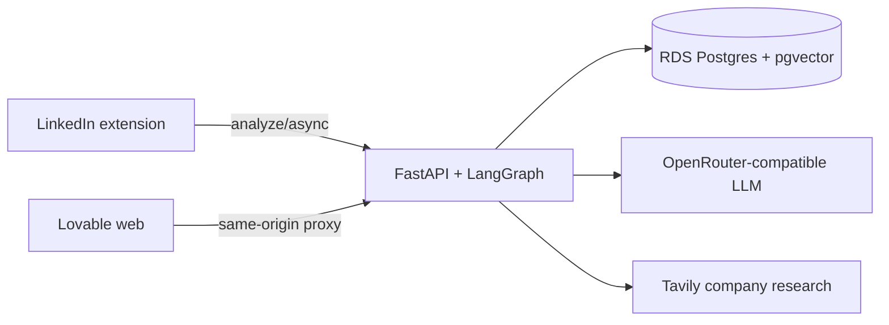

# JobLens

JobLens is a visa-aware job-fit assistant. Paste a posting in the web app or
open a LinkedIn job with the Chrome extension; both surfaces call the same API
and return the same evidence-backed report:

- H-1B/LCA employer history
- Role, Resume, Location, and Company fit
- Preference and dealbreaker hits
- Apply · Near apply · Consider · Skip

## Live system

| Surface | Location |
|---|---|
| Web | https://job-lens-main.lovable.app |
| API | https://3-128-164-130.sslip.io |
| Chrome extension | [`extension/`](extension/) — load unpacked |

JobLens is split across two repositories:

| Repository | Responsibility |
|---|---|
| `joblens` | FastAPI backend, Chrome extension, shared report renderer, evals, deploy scripts |
| `vision-job-glow` | Lovable/TanStack web application and API proxy |

## Architecture



Both clients submit the same request shape and render the same `Report` JSON.
Input collection differs—LinkedIn Voyager/DOM in the extension versus URL
fetch/manual paste on the web—so parity is measured from normalized inputs and
dimension results, not identical prose.

The analyze pipeline:

1. Resolve the logged-in profile and resume; guests use the golden defaults.
2. Parse the JD and look up H-1B history in parallel.
3. Score Resume and research Company evidence.
4. Run Role, Location, and Preference/Dealbreaker decisions independently.
5. Apply deterministic guardrails; call the Final Verdict LLM only for boundary cases.
6. Assemble the report and persist an optional trace.

See [architecture](docs/ARCHITECTURE.md) and the authoritative
[scoring standard](docs/SCORING_STANDARD.md).

## Repository map

```text
backend/
  app/
    graph/                 LangGraph workflow and report assembly
    schemas/               CandidateProfile and Report contracts
    tools/                 parsing, RAG, scoring, research, decisions
  tests/                   offline unit/regression tests
extension/                 Chrome MV3 LinkedIn client
shared/                    report renderer and async analyze client
design/                    shared tokens and report CSS
evals/golden_set/          profile, resume, labeled job postings
data-pipeline/             DOL/LCA ingestion and employer enrichment
db/, deploy/               Postgres schemas and AWS/EC2 deployment
docs/                      current architecture and operating docs
```

The deployed web app is only in the sibling `vision-job-glow` repository.
There is no second web implementation in this repository.

## Scoring contract

The dimensions are independent:

| Dimension | Primary | Fallback |
|---|---|---|
| Role | LLM over title + JD + configured tracks | full-role embedding; similarity must be ≥ 0.55 |
| Resume | RAG retrieval + LLM per requirement | vector bands: 0.80 / 0.60 / 0.40 |
| Location | LLM geographic classification | deterministic geography, then semantic matching |
| Company | Tavily/structured evidence + LLM | cached evidence + embeddings |
| Preferences / dealbreakers | LLM exact configured-item classification | semantic/strict rules |
| Final verdict | deterministic clear cases; LLM for boundaries | deterministic boundary rules |

Users configure Role and Location P1–P3. P4 is assigned by the system for an
unmatched or extremely-low result. An unmatched P4 is not an automatic Skip;
an explicit `avoid_track` may be.

All thresholds, evidence rules, guardrails, and prohibited coupling live in
[docs/SCORING_STANDARD.md](docs/SCORING_STANDARD.md). Do not duplicate them in
another document.

## Local development

Requirements: Docker, Python 3.12, and Node for the sibling web repo.

```bash
cp .env.example .env
# Fill LLM_API_KEY and optionally TAVILY_API_KEY.
docker compose up -d --build
curl http://localhost:8000/health
```

Run backend tests:

```bash
PYTHONPATH=backend pytest -q backend/tests
```

Load the extension:

1. Open `chrome://extensions`.
2. Enable Developer mode.
3. Choose **Load unpacked** and select `extension/`.

Web development is documented in the sibling repo README.

## Shared UI workflow

The report renderer is maintained in this repo:

```bash
./scripts/sync-shared-ui.sh
./scripts/sync-design-tokens.sh
```

The scripts copy report code and styles to the extension and sibling web repo.
Web-only screens such as Profile and the test Debug Console remain in
`vision-job-glow`.

## Golden-set evaluation

The golden set is a developer/evaluation fixture, not the production source of
truth for logged-in accounts. Production profiles are stored in Postgres.

```bash
cd evals
python3 run_eval.py
# BASE_URL=https://3-128-164-130.sslip.io python3 run_eval.py
```

Each label is optional; blank fields are skipped. See
[evals/golden_set/README.md](evals/golden_set/README.md).

## Debugging

Every analysis has a unique `run_id`. Compare different runs by their inputs,
profile version, prompt versions, evidence, and validated decisions—not by the
run ID itself.

The configured test account can open the Web **Debug** view and inspect:

- independent decision method (`llm`, `embedding/rules`, `rules`)
- actual inputs and evidence
- raw structured output and validated output
- validation/fallback errors
- final rule overrides

Raw debug records are removed server-side for other accounts and anonymous
requests. Operational traces are exposed through `/observability/traces` only
to the configured debug account.

## Deployment

Backend changes:

```bash
cd /opt/joblens
git pull
bash deploy/ec2-redeploy.sh
```

Web changes must be pushed to `vision-job-glow` and then published in Lovable.
Extension changes require reloading the unpacked extension. Shared UI changes
require syncing both repositories first.

## Documentation

| Document | Authority |
|---|---|
| [ARCHITECTURE.md](docs/ARCHITECTURE.md) | Current components and request flow |
| [SCORING_STANDARD.md](docs/SCORING_STANDARD.md) | Scoring, fallbacks, guardrails, debug records |
| [REPORT_SCHEMA.md](docs/REPORT_SCHEMA.md) | API response and evidence contract |
| [DATABASE.md](docs/DATABASE.md) | Persisted data and Postgres tables |
| [MULTI_SURFACE.md](docs/MULTI_SURFACE.md) | Extension/web synchronization and publishing |
| [CODEX_HANDOFF.md](docs/CODEX_HANDOFF.md) | Short operational handoff for coding agents |
| [evals/README.md](evals/README.md) | Evaluation workflow |

Historical product plans and duplicate threshold documents have been removed;
Git history remains the archive.
