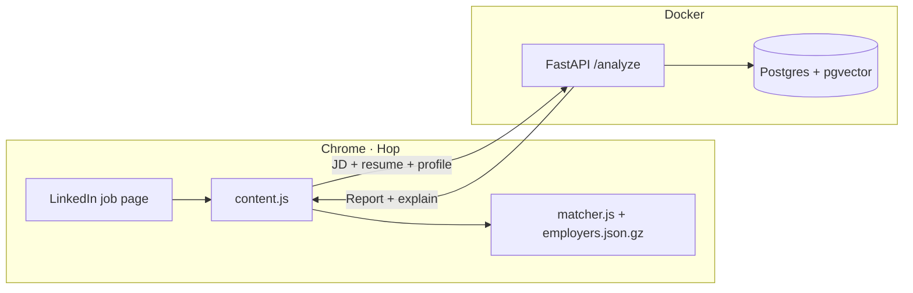

# Hop — LinkedIn Job Intelligence

Chrome extension panel on LinkedIn job pages: **DOL H-1B employer lookup** plus **Apply / Consider / Skip** job-fit analysis backed by a FastAPI backend.

> GitHub repo is still named [`lca-linkedin-checker`](https://github.com/nicole732470/lca-linkedin-checker) from the original H-1B-only project. The product UI is **Hop** (extension v2.9+).

## What you get on a job posting

| Layer | What it shows |
|-------|----------------|
| **H-1B** | Entity-resolved DOL match, filing counts, top sponsored titles — offline in the extension |
| **Verdict** | Apply · Consider · Skip from profile + JD + resume (never from H-1B alone) |
| **Fit grid** | Role P · Resume % · Location P · Company P · Prefs · Flags — hover any cell for the reasoning |
| **Signals** | LinkedIn followers, alumni lines, industry — each on its own row |

Personal rules live in [`evals/golden_set/candidate_profile.yaml`](evals/golden_set/candidate_profile.yaml) (tracks, dealbreakers, preferences, technical penalties, alumni schools). Tune without code changes.

**Principle:** evidence over keyword matching — see [`docs/FIT_AND_RECOMMENDATION.md`](docs/FIT_AND_RECOMMENDATION.md).

---

## Quick start

### 1. Chrome extension (H-1B works offline)

Ships with `extension/data/employers.json.gz` — no server required for sponsorship lookup.

```bash
git clone https://github.com/nicole732470/lca-linkedin-checker.git
cd lca-linkedin-checker
```

1. Open `chrome://extensions` → **Developer mode** → **Load unpacked** → `extension/`
2. Open a [LinkedIn job posting](https://www.linkedin.com/jobs/)

Fit analysis needs the backend (step 2).

### 2. Backend (JD parsing, resume fit, recommendation)

```bash
cp .env.example .env   # add LLM_API_KEY (OpenRouter or compatible)
docker compose up -d --build
curl http://localhost:8000/health
```

Reload the extension. The panel calls `http://localhost:8000/analyze` automatically.

### 3. Evaluation (optional)

```bash
cd evals && python3 run_eval.py
```

Golden set: [`evals/golden_set/samples.csv`](evals/golden_set/samples.csv) · labels: [`evals/golden_set/README.md`](evals/golden_set/README.md).

---

## Architecture



- **Extension:** reads visible page text (JD, followers, alumni hints) — no LinkedIn scraping backend.
- **Backend:** JD parse, resume–requirement fit, role/location/company scoring, recommendation.
- **H-1B index:** built offline from DOL LCA disclosure data (`data-pipeline/`).

---

## Repository layout

```
.
├── extension/           # Hop — Chrome MV3 (content.js, matcher.js, styles)
├── backend/             # FastAPI — /analyze, profile, resume RAG
├── evals/               # Golden set + run_eval.py
├── evals/golden_set/    # candidate_profile.yaml, samples.csv, resume.md
├── data-pipeline/       # DOL Excel → SQLite → employers.json.gz
├── docs/                # Design, report schema, fit thresholds
└── docker-compose.yml
```

---

## H-1B entity resolution (extension)

LinkedIn slug/display name ≠ DOL legal entity name. The matcher is **evidence-first** (meaningful token overlap, ambiguity checks) — not a numeric “match score.”

| Pill | Meaning |
|------|---------|
| **H-1B sponsor** | Strong entity match or high filing volume + approval rate |
| **Likely H-1B sponsor** | Moderate filings, good approval |
| **Possible sponsor** | Weaker name evidence — verify legal name manually |
| **No H-1B record** | No reliable DOL match |

Confidence is **name-resolution** confidence, not “will they sponsor this job.”

Implementation: [`extension/lib/matcher.js`](extension/lib/matcher.js) · index export: [`data-pipeline/export_employer_index.py`](data-pipeline/export_employer_index.py) · tests: `data-pipeline/test_entity_resolution.py`.

### Rebuild H-1B index (optional)

Download [DOL LCA Disclosure Data](https://www.dol.gov/agencies/eta/foreign-labor/performance), place the Excel in `data-pipeline/`, then:

```bash
cd data-pipeline
python3 convert_to_sqlite.py
python3 export_employer_index.py
```

Reload the extension after re-export.

**Current index (shipped):** FY2026 Q2 · ~785k H-1B filings · ~69k employers (FEIN).

---

## Debug a verdict

1. Hover a metric cell in the Hop panel (structured tooltip).
2. DevTools → Console: `__hopLastReport.explain`
3. DevTools → Network → `POST /analyze` → JSON `explain` field

---

## Documentation

| Doc | Contents |
|-----|----------|
| [`docs/DESIGN.md`](docs/DESIGN.md) | Product goals, architecture, roadmap |
| [`docs/FIT_AND_RECOMMENDATION.md`](docs/FIT_AND_RECOMMENDATION.md) | Profile model, Apply/Skip logic |
| [`docs/REPORT_SCHEMA.md`](docs/REPORT_SCHEMA.md) | `/analyze` response shape |
| [`docs/FIT_THRESHOLDS.md`](docs/FIT_THRESHOLDS.md) | Resume fit weights, tuning notes |
| [`backend/README.md`](backend/README.md) | API layout |

---

## Stack

| Layer | Tech |
|-------|------|
| Extension | Chrome MV3 · offline DOL index (gzip JSON) |
| Backend | FastAPI · Postgres · pgvector · LLM (OpenRouter-compatible) |
| Pipeline | Python · SQLite · DOL LCA Excel |

---

## License

MIT — DOL public data subject to federal open-data terms.
