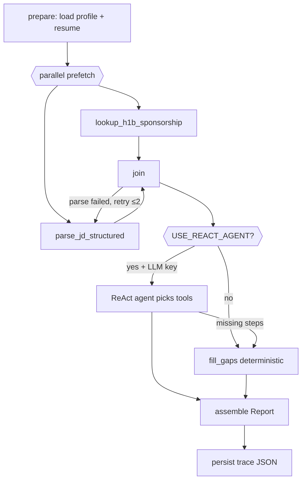

# JobLens

**Worth applying? Check in two minutes.**

Chrome extension + web app + API that help you **skip bad applications** before you spend time on them. JobLens checks **visa sponsorship first**, then whether the **role matches your profile** and **resume matches the JD** — with evidence you can hover to inspect.

| Surface | URL / where |
|---------|-------------|
| **Web** | [job-lens-main.lovable.app](https://job-lens-main.lovable.app) — sign up, paste a job link, get a verdict |
| **Extension** | `extension/` — same analysis inline on LinkedIn job pages |
| **API** | `https://3-128-164-130.sslip.io` (HTTPS via Caddy on EC2) |

Repos: [`joblens`](https://github.com/nicole732470/joblens) (backend + extension) · [`vision-job-glow`](https://github.com/nicole732470/vision-job-glow) (Lovable web UI)

---

## Product copy (unified across surfaces)

Use this language everywhere — web meta, extension panel, README, LinkedIn posts:

| Context | Copy |
|---------|------|
| **One-liner** | Worth applying? Check in two minutes. |
| **Value prop** | Skip bad applications — check sponsorship and fit before you apply. |
| **How it works** | Paste a job link (or open on LinkedIn). We check **visa sponsorship** first, then **role + resume match**. |
| **Verdicts** | **Apply** · **Near apply** · **Consider** · **Skip** — rule-based, with hover tooltips for evidence. |
| **H-1B pill** | Answers “does this company file H-1B?” — **informational only**, never drives Apply/Skip. |
| **Not** | We do not predict “will they sponsor you personally.” We surface DOL filing history + JD visa language. |

---

## Architecture

Three surfaces, **one API**. No code sync between repos — both web and extension call the same EC2 backend.

```
LinkedIn job page
    │
    ├── Chrome extension (offline H-1B pill + POST /analyze)
    │
Web (Lovable, HTTPS)
    │
    └── browser → /api/* proxy → EC2 API (HTTPS sslip.io)
                              │
                    ┌─────────┴─────────┐
                    │  FastAPI + LangGraph │
                    │  Postgres + pgvector │
                    │  OpenRouter (LLM)    │
                    └─────────────────────┘
```

| Surface | Repo | Calls API via |
|---------|------|---------------|
| Extension | `joblens/extension/` | Direct `POST /analyze` (sync) |
| Web | `vision-job-glow` | Same-origin `/api/*` → server proxy → EC2 |
| Backend | `joblens/backend/` | — |

Design tokens: `design/tokens.css` → sync with `./scripts/sync-design-tokens.sh`.  
Details: [`docs/MULTI_SURFACE.md`](docs/MULTI_SURFACE.md)

---

## What each layer shows

| Layer | Source | Affects verdict? |
|-------|--------|------------------|
| **H-1B pill** (extension) | Offline `employers.json.gz` + `matcher.js` | **No** — informational |
| **H-1B block** (web report) | Backend `search_h1b_company()` — same DOL data in Postgres | **No** |
| **JD visa language** | LLM parse + regex fallback | **Yes** — hard Skip if you need sponsorship |
| **Role track (P-tier)** | Embedding title ↔ profile tracks | **Yes** — P4–P5 → Skip |
| **Resume fit** | RAG + LLM classify per requirement | **Yes** — drives Apply bar |
| **Dealbreakers** | Profile phrases matched in JD | **Yes** — hard Skip |
| **Location tier** | Profile location rules | Summary text only |
| **Company score** | Preferences + industry + followers | Summary text only |

---

## Metrics — how every number is derived

This is the full scoring model. Constants live in `backend/app/tools/*.py`; thresholds are documented in [`docs/FIT_THRESHOLDS.md`](docs/FIT_THRESHOLDS.md).

### 1. H-1B entity resolution (extension + backend)

**Question answered:** “Which DOL legal employer matches this LinkedIn company name?”

**Files:** `extension/lib/matcher.js`, `backend/app/tools/entity_resolver.py`, `backend/app/tools/sponsorship.py`

**Pipeline:**
1. Normalize LinkedIn slug + page display name (`text_normalize.py`)
2. Look up `company_search_keys` in Postgres (from DOL LCA pipeline)
3. Rank candidates by token overlap, exact core match, ambiguity penalties
4. Assign `match_confidence`: `high` | `medium` | `low`

**Rank score** (sort key, not a probability):
```
rank_score = (1_000_000 if exact_core_match else 0)
           + shared_token_count × 10_000
           + floor(token_overlap_ratio × 1_000)
           - ambiguity_penalty × 100
```

**Outputs shown:** `total_lca_count`, `h1b_count`, `certified_count`, `sponsored_titles`, `warnings`, `ambiguous_alternatives`

**Extension pill mapping:**
| Confidence + volume | Pill |
|---------------------|------|
| High match or many filings | H-1B sponsor |
| Medium / fuzzy | Likely / Possible sponsor |
| No match | No H-1B record |

**Not implemented:** `sponsorship_likelihood` field exists in schema but is always `Unknown` (designed in `docs/DESIGN.md`, not coded).

---

### 2. Role track match (title → profile track)

**Question answered:** “Which of my target tracks does this job title resemble?”

**File:** `backend/app/tools/track_match.py` — `match_job_to_profile()`

**Important:** Only the **job title** is embedded — JD body is ignored for track family.

**Pipeline:**
1. Exact match on track label or `example_titles` → similarity **1.0**
2. Keyword rules (e.g. “solutions engineer” → `pm_eng`, “analyst” → `business_analyst`)
3. Embedding fallback: cosine similarity between title and each track descriptor

**Thresholds:**
| Constant | Value | Meaning |
|----------|-------|---------|
| `_TRACK_MATCH_MIN` | **0.30** | Min cosine sim to accept a want-track |
| `_AVOID_MATCH_MIN` | **0.38** | Min sim for avoid-track; must beat best want-track |

**Tie-break:** equal similarity → lower priority number wins (P1 beats P2).

**Output:** `track_id`, `track_label`, `track_similarity`, `track_priority` (after adjustments below)

---

### 3. Role priority (P-tier adjustments)

**Question answered:** “Given this title + JD + resume, what priority tier (1–5) should this role be?”

**Base:** Each profile track has `priority` 1–5 in `candidate_profile.yaml` (1 = most wanted).

**File:** `backend/app/tools/role_priority.py` — applied in order by `recommendation.py`

| Adjustment | Trigger | Effect |
|------------|---------|--------|
| `apply_jd_role_adjustments` | Title/JD family mismatch | Track swaps (e.g. solution engineer on AI track → `pm_eng`); floors (e.g. research-heavy JD on `ai_eng` → min P4) |
| `apply_technical_penalties` | JD mentions `technical_penalties` from profile | P1–P2: **+1 tier** (cap 5). P3: → **P4** |
| `apply_resume_priority_adjustment` | Resume vs JD overlap | P1–P2 + fit ratio **< 0.20** + ≥2 pure gaps → **+1 tier**. P3+ + ratio **≥ 0.40** + ≥2 strong → **−1 tier** (min 1) |

**Hard rule:** `track_priority ≥ 4` → automatic **Skip** (`_SKIP_PRIORITY_MIN = 4`).

---

### 4. JD parsing

**Question answered:** “What are the structured requirements, visa phrases, and risk keywords in this posting?”

**File:** `backend/app/tools/jd_parser.py` — `parse_job_description()`

**Primary path (LLM):** structured JSON with categories:
`required_skill`, `preferred_skill`, `experience`, `education`, `responsibility`, `location`, `visa`, `risk_keyword`, `other`

Each requirement gets `id` (`jd_req_01`, …) and `evidence_quote` from the JD.

**Fallback** (no LLM or garbage response): line/bullet split + regex — max 15 requirements, visa regex for sponsorship phrases.

**Retries:** LangGraph `node_parse_jd` retries up to **2** times if parse fails or returns empty requirements.

---

### 5. Resume fit (RAG + LLM)

**Question answered:** “For each JD requirement, does my resume actually satisfy it?”

**Files:** `resume_store.py`, `resume_fit.py`, `resume_fit_llm.py`, `resume_chunker.py`

**Ingest:**
1. Resume → section-aware chunks (`resume_chunker.py`)
2. Each chunk embedded (`text-embedding-3-small`, 1536-dim) → stored in `resume_chunks` (pgvector)
3. Per-user key: `user_{uuid}` after `/resume/upload`; guest uses golden-set resume

**Per requirement:**
1. Embed requirement text as query
2. Retrieve top-**3** chunks by cosine distance (`<=>` in pgvector)
3. Classify: **strong** | **partial** | **missing**

**Classification method** (`RESUME_FIT_METHOD` env):

| Mode | How |
|------|-----|
| `auto` (default) | LLM if key available, else vector |
| `llm` | LLM reads retrieved snippets, batches of 8 reqs |
| `vector` | Distance thresholds on closest chunk only |

**Vector thresholds:**
| Cosine distance | Label |
|-----------------|-------|
| ≤ **0.34** | strong |
| **0.34 – 0.52** | partial |
| **> 0.52** | weak → counted in `missing` |

**Fit ratio** (feeds verdict):
```
effective = strong + partial × 0.5 + weak × 0.3
fit_ratio = effective / total_requirements
pure_gap  = missing reqs with no resume evidence at all
```

Weights: `_PARTIAL_WEIGHT = 0.5`, `_WEAK_WEIGHT = 0.3` in `recommendation.py`.

---

### 6. Location score

**File:** `backend/app/tools/profile_signals.py` — `score_location()`

| Tier | `location_score` | Rule |
|------|------------------|------|
| P1 | 1.0 | Place in `tier_1` locations |
| P2 | 0.75 | `tier_2` or remote-ok + JD allows remote |
| P3 | 0.25–0.35 | `tier_3`, onsite unknown, rural |
| Unspecified | 0.5 | Default |

**Used in:** recommendation `summary` text only — does **not** change Apply/Skip today.

---

### 7. Company score

**File:** `backend/app/tools/company_signals.py` — `score_company()`

```
combined = 0.50×preferences + 0.28×industry + 0.12×followers + 0.10×alumni
         + bonus (+0.08 if ≥2 pref hits, +0.04 if ≥1)
```

| Component | Scoring |
|-----------|---------|
| Preferences | Semantic phrase match, cosine ≥ **0.36** → `0.35 + 0.65×(hits/total)` |
| Industry (NAICS) | Tech **0.88**, Finance **0.72**, Traditional **0.48**, unknown **0.55** |
| LinkedIn followers | ≥50k **0.72**, ≥5k **0.65**, else **0.58** |
| Alumni hints | **0.55 + 0.15×min(hits, 2)** |

**Company tier:** score ≥ **0.52** → P1, ≥ **0.38** → P2, else P3. Dealbreaker industry → forced P3, score **0.25**.

**Used in:** report display + summary — does **not** change Apply/Skip today.

---

### 8. Risk rules

**File:** `backend/app/tools/risk_rules.py` — `run_risk_rules()`

| Risk | Trigger |
|------|---------|
| JD visa veto | `needs_sponsorship` + JD says “no sponsorship” / “must be authorized” etc. |
| Zero overlap | ≥ **3** missing reqs AND **0** strong |
| Risk keywords | JD `risk_keywords` from parse (e.g. unpaid, commission-only) |

JD visa veto is a **hard Skip** before fit scoring runs.

---

### 9. Final verdict (Apply / Near apply / Consider / Skip)

**File:** `backend/app/tools/recommendation.py` — `generate_recommendation()`

**Hard Skip paths** (checked first):
1. Dealbreakers matched in JD
2. JD visa veto + `needs_sponsorship: true`
3. Avoid-track semantic match (sim ≥ 0.38)
4. `track_priority ≥ 4`

**Fit-based verdicts** (after hard skips):

| Verdict | Conditions |
|---------|------------|
| **Apply** | `strong ≥ 2` AND `fit_ratio ≥ 0.50` |
| **Near apply** | Track P1–P2, title sim ≥ **0.30**, fit ≥ **0.22**, below Apply bar, no role penalty |
| **Consider** | fit ≥ **0.28**, OR enough partial/weak touches, OR P1–P2 floor with fit ≥ **0.12** |
| **Skip** | Below all floors |

**Priority floor:** P1–P2 title match cannot end as Skip — bumped to at least **Consider**.

**Explain block:** `main.py` → `_build_explain()` adds flags, company breakdown, role priority/similarity/fit_ratio for debugging.

---

### 10. Analyze pipeline (LangGraph)

**Entry:** `POST /analyze` or `POST /analyze/async` → `graph/workflow.py`



**Tool order** (agent + fill_gaps fallback):
1. `lookup_h1b_sponsorship`
2. `parse_jd_structured`
3. `score_resume_against_jd`
4. `score_company_fit`
5. `assess_job_risks`
6. `recommend_apply_skip`

**Async** (web): `POST /analyze/async` → poll `GET /analyze/jobs/{job_id}` every 1.5s. Avoids gateway timeouts on long runs.

---

## API reference

**Base URL (production):** `https://3-128-164-130.sslip.io`  
**OpenAPI:** `GET /openapi.json`

### Auth

| Route | Body | Response |
|-------|------|----------|
| `POST /auth/register` | `{ email, password }` (≥8 chars) | `{ token, user_id, email }` |
| `POST /auth/login` | `{ email, password }` | same |

JWT: HS256, 30-day expiry. Header: `Authorization: Bearer <token>`

### Profile & resume

| Route | Auth | Purpose |
|-------|------|---------|
| `GET /me/profile` | required | Load saved profile JSON |
| `PUT /me/profile` | required | Save profile (tracks, locations, dealbreakers, …) |
| `POST /resume/upload` | required | PDF upload (≤5MB) → extract text → index pgvector |
| `POST /resume/index` | — | Manual `{ resume_text, resume_key? }` → chunk + embed |
| `GET /candidate-profile` | optional | User profile if logged in, else YAML default |

**Profile shape** matches `evals/golden_set/candidate_profile.yaml` — see `backend/app/schemas/candidate_profile.py`.

### Analyze

| Route | Auth | Purpose |
|-------|------|---------|
| `POST /analyze` | optional | Sync — returns full `Report` (extension uses this) |
| `POST /analyze/async` | optional | Start background job → `{ job_id, run_id, status }` |
| `GET /analyze/jobs/{job_id}` | — | Poll status + `steps[]` + `report` when done |
| `POST /jobs/parse-url` | — | Fetch URL → `{ ok, title, company, jd_text }` (LinkedIn often blocked server-side) |

**Analyze request:**
```json
{
  "jd_text": "required unless job_url resolves it (min 40 chars)",
  "company": "optional",
  "title": "optional",
  "job_url": "optional",
  "resume_text": "optional override",
  "linkedin_followers": null,
  "alumni_hints": []
}
```

Logged-in users: backend auto-loads profile + uploaded resume from Postgres.

### Report shape (top-level)

| Field | Contents |
|-------|----------|
| `status` | `complete` or `partial` |
| `pending` | Missing steps, e.g. `jd_parsing` |
| `sponsorship` | H-1B entity match + LCA counts |
| `company` | Company score + tier + breakdown |
| `jd` | Parsed requirements, visa_language, risk_keywords |
| `resume_fit` | strong/partial/missing claims with evidence IDs |
| `risk` | Rule-triggered risks |
| `recommendation` | `decision`, `fit_ratio`, `track_priority`, `summary` |
| `explain` | Debug flags, observability steps, match_method |

Full schema: [`docs/REPORT_SCHEMA.md`](docs/REPORT_SCHEMA.md)

### Debug routes

| Route | Purpose |
|-------|---------|
| `GET /health` | DB, LLM, agent mode, LangSmith, trace_dir |
| `GET /tools` | List 6 analyze tools |
| `POST /tools/{name}` | Invoke one tool with `{ arguments: {} }` |
| `GET /observability/traces` | List recent trace files |
| `GET /observability/traces/{run_id}` | Full trace JSON |

---

## How surfaces connect to the API

### Web (vision-job-glow)

Browser cannot call HTTP EC2 directly (mixed content). Flow:

```
Browser  →  POST /api/analyze/async  (same-origin HTTPS)
         →  TanStack server proxy (src/routes/api/$.tsx)
         →  https://3-128-164-130.sslip.io/analyze/async
         →  poll /api/analyze/jobs/{id}
```

Default backend URL is hardcoded in `api/$.tsx` — no Lovable Environment panel needed.

**Live:** [job-lens-main.lovable.app](https://job-lens-main.lovable.app)

### Extension

```
content.js scrapes JD + company + title from LinkedIn DOM
    → chrome.runtime.sendMessage({ type: "JOBLENS_ANALYZE", body })
    → background.js fetch POST /analyze (sync)
    → renders verdict + fit grid in panel
```

H-1B pill runs **entirely offline** in `content.js` + `matcher.js` before any API call.

**Backend URL** (update when domain changes): `extension/background.js`, `extension/content.js`  
**Host permission:** `extension/manifest.json`

### Auth flow (web only today)

1. Register/login → store `joblens_token` in localStorage
2. Onboarding → `PUT /me/profile` + optional `POST /resume/upload`
3. Analyze → Bearer token auto-attached; backend loads your profile + resume

Extension does not use auth yet — uses guest YAML profile on the server.

---

## Tech stack

| Layer | Technology |
|-------|------------|
| **Extension** | Chrome MV3, vanilla JS, offline DOL gzip index |
| **Backend** | Python 3.12, FastAPI, uvicorn |
| **Orchestration** | LangGraph + LangChain ReAct agent |
| **Database** | PostgreSQL 16 + pgvector (RDS on EC2 prod) |
| **Auth** | bcrypt + PyJWT |
| **LLM** | OpenRouter-compatible API (chat + embeddings) |
| **Embeddings** | `text-embedding-3-small` (1536-dim) |
| **Web** | TanStack Start, React 19, Tailwind 4, Vite 8, Lovable hosting |
| **Deploy** | Docker on EC2, Secrets Manager, Caddy (sslip.io TLS) |
| **Observability** | Local trace JSON + optional LangSmith |

---

## Quick start (local)

### Extension

```bash
git clone https://github.com/nicole732470/joblens.git && cd joblens
```

Chrome → `chrome://extensions` → Developer mode → **Load unpacked** → `extension/`

### Backend

```bash
cp .env.example .env          # set LLM_API_KEY from openrouter.ai
docker compose up -d --build
curl http://localhost:8000/health
```

Expected: `"database": "connected"`, `"llm": "configured"`, `"orchestration": "langgraph-react"`

Reload extension → panel calls `http://localhost:8000/analyze`.

### Eval

```bash
cd evals && python3 run_eval.py
```

Compares golden set: `expected_sponsors`, `expected_priority`, `expected_decision`.

### Tests

```bash
cd backend && python -m pytest tests/ -q
```

---

## Debug playbook

When something looks wrong, work through this order:

### 1. Is the API up?

```bash
curl https://3-128-164-130.sslip.io/health
curl https://job-lens-main.lovable.app/api/health   # web proxy path
```

### 2. Extension panel

- Hover metric cells for tooltips (Resume shows **LLM + RAG** vs **Vector only**)
- DevTools console: `__jobLensLastReport.explain`
- Network tab → `POST /analyze` → check `explain.resume_fit.match_method`, `explain.observability.steps`

### 3. Trace files

Every analyze run writes `logs/traces/{run_id}.json` on the server.

```bash
curl https://3-128-164-130.sslip.io/observability/traces
curl https://3-128-164-130.sslip.io/observability/traces/{run_id}
```

### 4. Single-tool isolation

```bash
curl https://3-128-164-130.sslip.io/tools
curl -X POST https://3-128-164-130.sslip.io/tools/parse_jd_structured \
  -H "Content-Type: application/json" \
  -d '{"arguments": {"jd_text": "...", "title": "..."}}'
```

### 5. LangSmith (optional)

Set `LANGCHAIN_API_KEY` in Secrets Manager → redeploy. `/health` shows `"langsmith": true`. Traces appear in project `joblens-analyze`.

### 6. Common failure modes

| Symptom | Likely cause | Fix |
|---------|--------------|-----|
| Web login/register fails | API down or proxy broken | Check `/api/health`; was Cloudflare 1003 when proxy pointed at bare IP — now fixed via sslip.io |
| LinkedIn URL parse fails on web | LinkedIn blocks server fetch | Use extension on LinkedIn, or paste JD manually in the 3-field form |
| All resume fit = missing | Resume not indexed | `POST /resume/upload` or `/resume/index` |
| Verdict always Skip, P4+ | Title matched low-priority track | Check `explain.role.track_id` and profile track priorities |
| `match_method: vector` only | No LLM key or LLM classify failed | Set `LLM_API_KEY`; check logs |
| H-1B pill ≠ backend block | Extension uses offline index; backend uses Postgres | Rebuild `employers.json.gz` + reload RDS if stale |

### 7. Redeploy EC2

```bash
# via SSM on instance i-0bdee6f611283586f:
cd /opt/joblens && git pull && bash deploy/ec2-redeploy.sh
```

Applies SQL schemas, rebuilds Docker, sets `USE_REACT_AGENT=true`.

---

## Production deployment

| Resource | Value |
|----------|-------|
| Region | `us-east-2` |
| EC2 | `i-0bdee6f611283586f` (`joblens-api`, t3.small) |
| Elastic IP | `3.128.164.130` |
| HTTPS | `https://3-128-164-130.sslip.io` (Caddy, TLS-ALPN on 443) |
| HTTP debug | `http://3.128.164.130:8000` |
| RDS | `joblens-db` (Postgres 16 + pgvector) |
| Secrets | `joblens/rds`, `joblens/app` (Secrets Manager) |

Scripts: `deploy/ec2-user-data.sh`, `deploy/ec2-redeploy.sh`, `deploy/setup-caddy-sslip.sh`, `deploy/ensure-app-secrets.sh`

Full inventory: [`deploy/aws-resources.md`](deploy/aws-resources.md)

**Recommended next:** point a real domain (e.g. `api.joblens.app`) at the elastic IP with [`deploy/Caddyfile`](deploy/Caddyfile) — `api.joblens.app` currently resolves elsewhere.

---

## Repository layout

```
.
├── extension/              # Chrome MV3 — LinkedIn panel + offline H-1B
├── backend/
│   └── app/
│       ├── main.py         # FastAPI routes
│       ├── graph/          # LangGraph workflow + ReAct agent
│       ├── tools/          # Scoring, parse, RAG, recommendation
│       └── schemas/        # Report + profile Pydantic models
├── design/tokens.css       # Shared design tokens
├── evals/                  # Golden set + run_eval.py
├── data-pipeline/          # DOL Excel → employers index
├── db/                     # auth_schema.sql, init SQL
├── deploy/                 # EC2, Caddy, RDS scripts
├── docs/                   # Thresholds, report schema, multi-surface
└── docker-compose.yml      # Local dev (Postgres + backend)
```

---

## Configuration (`.env`)

| Variable | Purpose | EC2 default |
|----------|---------|-------------|
| `DATABASE_URL` | Postgres connection | RDS via Secrets Manager |
| `LLM_API_KEY` | OpenRouter chat + embeddings | Secrets Manager |
| `LLM_MODEL` | JD parse model | `openai/gpt-oss-20b:free` |
| `EMBEDDING_MODEL` | Resume/title embeddings | `text-embedding-3-small` |
| `RESUME_FIT_METHOD` | `auto` \| `llm` \| `vector` | `auto` |
| `USE_REACT_AGENT` | ReAct vs deterministic fill_gaps | `false` (prod; ReAct adds 2–4 min on free models) |
| `JWT_SECRET` | Auth signing | Secrets Manager |
| `TRACE_DIR` | Analyze trace JSON dir | `/app/logs/traces` |
| `LANGCHAIN_API_KEY` | LangSmith tracing | optional |

Template: [`.env.example`](.env.example)

---

## Documentation index

| Doc | Contents |
|-----|----------|
| [`docs/FIT_THRESHOLDS.md`](docs/FIT_THRESHOLDS.md) | All numeric thresholds |
| [`docs/FIT_AND_RECOMMENDATION.md`](docs/FIT_AND_RECOMMENDATION.md) | Profile model + recommendation design |
| [`docs/REPORT_SCHEMA.md`](docs/REPORT_SCHEMA.md) | `/analyze` JSON field reference |
| [`docs/DESIGN.md`](docs/DESIGN.md) | Original architecture + planned features |
| [`docs/MULTI_SURFACE.md`](docs/MULTI_SURFACE.md) | Extension + web + API sync |
| [`backend/README.md`](backend/README.md) | Backend layout (shorter) |
| [`evals/golden_set/README.md`](evals/golden_set/README.md) | Labeling golden set CSV |

---

## Status — what's done vs what remains

### Done (MVP complete)

- H-1B offline lookup (extension) + backend entity resolution
- Full analyze pipeline: JD parse → RAG resume fit → role/company/location → verdict
- LangGraph + ReAct agent + deterministic fill_gaps fallback
- Auth, profile, PDF resume upload (web)
- Async analyze + step polling (web)
- EC2 + RDS production deploy with HTTPS (sslip.io)
- Lovable web UI with unified design tokens
- Trace persistence + `/observability/traces`
- LangSmith integration (optional)
- Golden set eval harness

### Known gaps (not blocking demo, but real)

| Gap | Impact | Suggested fix |
|-----|--------|---------------|
| **Caddy not on systemd** | HTTPS may not survive EC2 reboot | Run `deploy/setup-caddy-sslip.sh` + enable `caddy.service` |
| **sslip.io is a stopgap** | Not a brand URL; depends on third-party DNS | Point `api.joblens.app` → elastic IP |
| **Extension uses HTTP bare IP** | Works but inconsistent with web HTTPS | Update `BACKEND_URL` to sslip.io + manifest host permission |
| **Extension has no auth** | Always uses guest YAML profile | Wire JWT from web or add extension login |
| **`sponsorship_likelihood` unimplemented** | Field always `Unknown` | Build heuristic or remove from UI |
| **Company/location don't affect verdict** | Shown but not in Apply/Skip math | Wire into `recommendation.py` or document as display-only |
| **LinkedIn parse-url blocked** | Web can't auto-fetch LinkedIn JDs | Extension or manual paste (already handled in UI) |
| **Time-aware gap classes** | Designed (`editable` / `fundamental`) but not coded | Future resume coaching feature |
| **Golden set coverage** | Small sample set | Keep adding rows to `evals/golden_set/samples.csv` |
| **MCP server** | Deferred by design | Skip unless portfolio needs it |

### Overall assessment

**Yes — core product development is essentially complete.** You have a working three-surface product (extension + web + API) with explainable scoring, auth, resume upload, and production hosting. What remains is **hardening** (proper domain, Caddy persistence, extension HTTPS + auth), **eval expansion**, and optional features from the design doc — not greenfield building.

---

## License

MIT — DOL public data subject to federal open-data terms.
