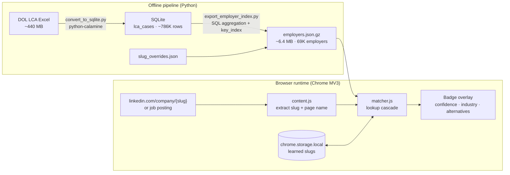
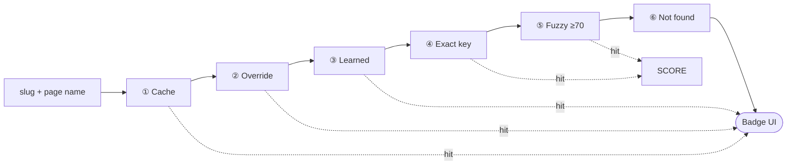
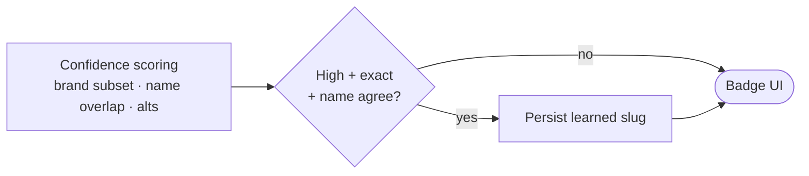

# LCA Sponsor Checker

Cross-reference LinkedIn company pages against U.S. Department of Labor (DOL) H-1B Labor Condition Application (LCA) disclosure data — fully offline, no backend.

LinkedIn exposes a **URL slug** and a **display name**. DOL records use **legal entity names** and **FEINs**. There is no shared identifier between the two systems, so matching is an **entity resolution** problem solved with a conservative lookup pipeline and human-verifiable signals on the badge.

**Data:** DOL LCA Disclosure · FY2026 Q2 · 785,687 H-1B filings · 69,250 employers (by FEIN)  
**Extension:** Chrome Manifest V3 · index v1.1 · extension v1.5.1

---

## Quick start

### Use the extension (pre-built index included)

The repo ships `chrome-extension/data/employers.json.gz`. You only need Chrome — no Python, no server.

```bash
git clone https://github.com/nicole732470/lca-linkedin-checker.git
cd lca-linkedin-checker
```

1. Open `chrome://extensions`
2. Enable **Developer mode** (top right)
3. Click **Load unpacked** → select the `chrome-extension/` folder
4. Visit any [LinkedIn company page](https://www.linkedin.com/company/) or job posting

A badge appears in the corner: **green** = confident LCA match, **yellow** = verify manually, **red** = no match in the index.

### Rebuild the index from DOL data (optional)

Download the latest [LCA Disclosure Data](https://www.dol.gov/agencies/eta/foreign-labor/performance) Excel file from DOL and place it in the repo root (default expected name: `LCA_Dislclosure_Data_FY2026_Q2.xlsx`). Then:

```bash
python3 -m venv .venv
source .venv/bin/activate          # Windows: .venv\Scripts\activate
pip install -r requirements.txt

python3 convert_to_sqlite.py       # Excel → lca_fy2026_q2.db (~1 min)
python3 export_employer_index.py   # SQLite → chrome-extension/data/employers.json.gz
```

Reload the extension on `chrome://extensions` after re-exporting.

**Test a slug without re-exporting** (uses existing `employers.json` if present):

```bash
python3 export_employer_index.py --test microsoft
python3 export_employer_index.py --test eversana
```

### Add a manual slug override

When LinkedIn’s slug does not map cleanly to a legal name, edit `slug_overrides.json`, then re-run `export_employer_index.py`:

```json
{
  "your-linkedin-slug": "XX-XXXXXXX"
}
```

FEIN comes from the DOL file or your local SQLite DB (`SELECT DISTINCT EMPLOYER_FEIN, EMPLOYER_NAME FROM lca_cases WHERE …`).

---

## End-to-end data flow



Raw `.xlsx` and `.db` files are gitignored (too large). The extension ships only the compressed index.

---

## Company identification workflow

On each LinkedIn company or job page, the extension extracts a **slug** (from the URL or company link) and optionally a **display name** (from the page heading or job card). Those inputs feed a fixed-order resolver — **first hit wins**; later stages run only when earlier ones miss.

**Lookup cascade** (left → right):



**After match at ④ or ⑤** (confidence + optional persistence):



### Why this order

| Stage | On hit | Why it runs before the next stage |
|-------|--------|-----------------------------------|
| **① Cache** | Same slug/name this session → return | Avoids repeat work on LinkedIn SPA re-renders |
| **② Override** | High confidence → badge | Curated slug → FEIN (`meta`, `eversana`, …) |
| **③ Learned** | High confidence → badge | Device-local slug verified on a prior visit |
| **④ Exact key** | Score → confidence → badge | O(1) hash lookup on precomputed keys |
| **⑤ Fuzzy** | Score ≥ 70 → confidence → badge | Last resort; whole-word tokens only |
| **⑥ Not found** | Red badge | No match above threshold |

Fuzzy matches are **never learned**. Only high-confidence exact paths with sufficient LinkedIn ↔ LCA name overlap are written to `chrome.storage.local`.

### Search key policy (export time)

Earlier versions generated single-token keys like `gamma` or `american`, causing thousands of collisions. Index v1.1 tightens key generation:

- Multi-word normalized legal names always become keys
- Single-token keys only when the token is ≥10 characters
- Hyphenated slug forms when the slug has ≥1 hyphen or length ≥10
- **No bare short single-word shortcuts**

Collisions on the same key resolve to the employer with the **highest `lca_count`**.

### Confidence scoring (runtime)

| Signal | Effect |
|--------|--------|
| Manual override or exact key hit | Score 95–100, usually **high** |
| **Brand subset** — LinkedIn shows `EVERSANA`, LCA lists `EVERSANA LIFE SCIENCE SERVICES, LLC` | Promotes to **high** with an explanatory note |
| LinkedIn name overlap &lt; 34% with LCA legal name | Downgrades to **medium/low** |
| Fuzzy match (`fuzzy_token` / `fuzzy_single`) | Floor score 70; warning to verify |
| Other candidates with similar scores | Listed as **alternatives** on yellow badges |
| ≤2 LCA filings | Weak sponsorship signal warning |

### Badge colors

| Color | Meaning |
|-------|---------|
| **Green** | Confident company match with LCA history |
| **Yellow** | Match found but uncertain — check legal name, industry (NAICS), alternatives |
| **Red** | No confident match in the index |

Green/yellow means the **entity** appears in LCA data, not that **this specific role** sponsors. Job descriptions may still exclude internships, entry level, or non-US candidates.

---

## Repository layout

```
.
├── convert_to_sqlite.py          # Excel → SQLite ingestion
├── export_employer_index.py      # SQLite → compressed JSON index
├── naics_sectors.py              # NAICS code → sector label
├── slug_overrides.json           # Curated LinkedIn slug → FEIN
├── requirements.txt
├── export_cook_county.py         # Cook County IL sponsor export
├── export_distribution.py        # National job/SOC distribution CSVs
├── data/                         # Derived CSVs and caches
├── docs/                         # Distribution summaries
└── chrome-extension/
    ├── manifest.json
    ├── content.js                # DOM extraction + badge UI
    ├── styles.css
    ├── lib/matcher.js            # Lookup engine
    └── data/employers.json.gz    # Pre-built index (~6.4 MB)
```

---

## Layer 1: Ingestion (Excel → SQLite)

DOL publishes LCA data as flat Excel. The FY2026 Q2 file is ~440 MB, ~807K rows × 98 columns; import filters to **785,687 H-1B** rows only.

| Decision | Rationale |
|----------|-----------|
| **python-calamine** | Rust-backed reader; ~47 s vs minutes with openpyxl |
| **SQLite** | Indexed random lookups; single-file portability for local SQL |
| **Batch insert + post-load indexes** | 13 indexes on filter columns after bulk load |
| **TEXT columns** | Mixed formats in source fields; avoids silent coercion |

Employers deduplicate by **FEIN**: 79,492 distinct names → **69,250** legal entities.

---

## Layer 2: Index export (SQLite → JSON)

The browser cannot read a ~940 MB SQLite file. Export aggregates per FEIN and ships a read-optimized artifact:

| Field | Purpose |
|-------|---------|
| `fein` | Stable legal-entity key |
| `name` / `names[]` | Primary and alias employer names |
| `search_keys[]` | Precomputed lookup tokens (strict policy above) |
| `lca_count`, `h1b_count`, `certified_count` | Headline sponsorship signals |
| `naics_code`, `naics_sector` | Industry context for verification |
| `top_jobs[]` | Top 3 roles by filing frequency |
| `key_index` | Inverted map `normalized_key → fein` |
| `slug_overrides` | Bundled manual slug → FEIN mappings |

Top jobs use one SQL window query (`ROW_NUMBER() OVER (PARTITION BY EMPLOYER_FEIN …)`). Raw JSON ~36 MB compresses to **~6.4 MB gzip** with **124,926** search keys.

---

## Layer 3: Chrome extension

| Component | Role |
|-----------|------|
| `content.js` | Extracts slug/name from company and job pages; `MutationObserver` + `popstate` for LinkedIn SPA navigation |
| `matcher.js` | Loads gzip index; runs lookup cascade; session cache + learned slug persistence |
| `styles.css` | Fixed badge: confidence, legal name, industry, warnings, alternatives |
| `employers.json.gz` | Web-accessible compressed index — no network calls after install |

**Permissions:** `storage` only (learned slugs). No telemetry, no remote API.

### Manual overrides

When slug and legal name diverge with no safe automatic key, add an entry to `slug_overrides.json` and re-export:

```json
{
  "eversana": "39-1821626",
  "meta": "20-1665019",
  "dun-bradstreet": "22-3582360"
}
```

---

## Data provenance

| Attribute | Value |
|-----------|-------|
| Source | DOL Office of Foreign Labor Certification — LCA Disclosure Data |
| Period | FY2026 Q2 |
| H-1B LCA records | 785,687 |
| Unique employers (FEIN) | 69,250 |
| Index search keys | 124,926 |

LCA filings are employer **attestations** of intent to employ H-1B workers — not confirmed hires or lottery outcomes. A company may file under a parent entity, PEO, or a name not visible on LinkedIn.

---

## Technology stack

| Layer | Technology |
|-------|------------|
| Excel ingestion | python-calamine (Rust via PyO3) |
| Storage | SQLite 3 |
| Index | JSON + gzip · browser `DecompressionStream` |
| Extension | Chrome Manifest V3 |
| Matching | Normalizer + inverted index + conservative fuzzy · no ML |

---

## License

MIT — DOL public data subject to federal open-data terms.
