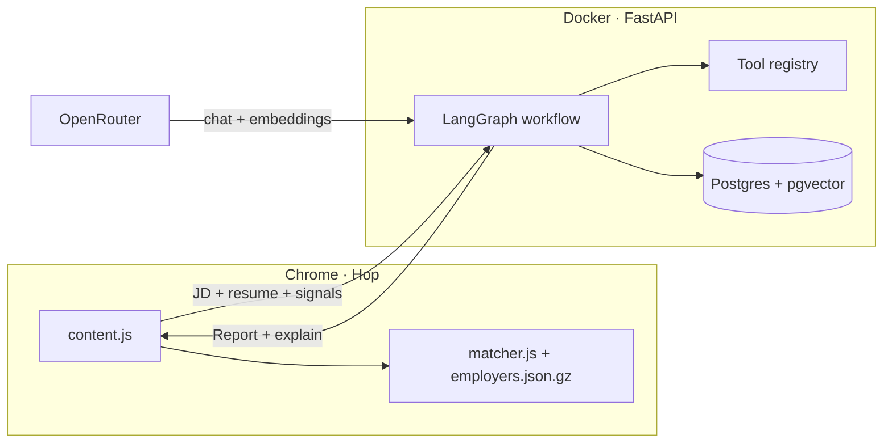

# Hop — LinkedIn Job Intelligence

Chrome extension + FastAPI backend for **evidence-based job decisions** on LinkedIn: DOL H-1B employer lookup (offline) and **Apply / Near apply / Consider / Skip** from your profile, JD, and resume.

> Repo name is still [`lca-linkedin-checker`](https://github.com/nicole732470/lca-linkedin-checker); the product UI is **Hop** (extension v2.9+).

---

## What this project is for

Hop is a **real product** (LinkedIn panel) and an **AI-engineering portfolio**:

| Goal | What you demonstrate |
|------|----------------------|
| **Product** | H-1B entity resolution + job-fit verdict on every posting |
| **RAG** | Resume chunked → pgvector → retrieve evidence per JD requirement |
| **LLM** | Structured JD parse + **LLM judgment** of resume fit (not distance-only) |
| **Agents** | **LangGraph** orchestration, **tool registry**, pipeline observability |
| **Eval** | Golden set + `run_eval.py` for regression |

**Deferred (by design):** MCP server, AWS deploy (needs your cloud account).

---

## Vector vs LLM — how they work together

This is the core mental model. **Embeddings and LLM chat solve different problems.**

```mermaid
flowchart TB
  subgraph ingest["Ingest"]
    JD[Job description text]
    RES[Resume text]
  end

  subgraph llm_chat["LLM chat (OpenRouter)"]
    PARSE[parse_job_description]
    CLASSIFY[classify_requirements_llm]
  end

  subgraph embed["Embeddings API (same OpenRouter key)"]
    EJD[Embed JD requirement queries]
    ERES[Embed resume chunks]
    ETITLE[Embed job title ↔ profile tracks]
  end

  subgraph pg["Postgres + pgvector"]
    STORE[(resume_chunks)]
  end

  subgraph rules["Deterministic rules"]
    REC[Apply / Near apply / Consider / Skip]
  end

  JD --> PARSE
  PARSE -->|requirements[]| EJD
  RES --> ERES --> STORE
  EJD --> STORE
  STORE -->|top-k chunks| CLASSIFY
  CLASSIFY -->|strong / partial / missing| REC
  ETITLE --> REC
  PARSE --> REC
```

| Step | Technology | Why |
|------|------------|-----|
| **JD → requirements[]** | **LLM** structured JSON | Free-text JD → typed list with quotes |
| **Resume → chunks** | Heuristic chunker | Section-aware splits |
| **Chunks → vectors** | **Embedding API** | Semantic search index in pgvector |
| **Requirement → evidence** | **Vector search** (RAG) | Find the *right paragraphs* to read — cheap, fast |
| **Evidence → strong/partial/missing** | **LLM** | Judgment call — "does this resume actually satisfy this req?" |
| **Title ↔ track (Role P)** | **Embedding** similarity | Semantic match without keyword lists |
| **Final verdict** | **Rules** on fit counts + profile | Explainable thresholds (see `docs/FIT_THRESHOLDS.md`) |

**Fallback:** if `LLM_API_KEY` is missing or LLM classify fails, resume fit uses **vector distance thresholds only** (`match_method: vector`). Set `RESUME_FIT_METHOD=vector` to force that path.

**Your OpenRouter key powers both:** chat completions (parse + classify) and embeddings (`text-embedding-3-small`).

---

## What you see on LinkedIn

| Layer | Source |
|-------|--------|
| **H-1B pill** | Extension offline (`employers.json.gz`) — no backend |
| **Verdict** | Backend — never from H-1B alone |
| **Fit grid** | Role · Resume · Location · Company · Preferences · Dealbreakers |
| **Hover tooltips** | Structured reasoning per metric |
| **Explain JSON** | `POST /analyze` → `explain` (pipeline trace, `match_method`, flags) |

Profile rules: [`evals/golden_set/candidate_profile.yaml`](evals/golden_set/candidate_profile.yaml)

---

## Quick start

### 1. Extension (H-1B offline)

```bash
git clone https://github.com/nicole732470/lca-linkedin-checker.git
cd lca-linkedin-checker
```

Chrome → `chrome://extensions` → Developer mode → **Load unpacked** → `extension/`

### 2. Backend (fit analysis)

```bash
cp .env.example .env
# Required: LLM_API_KEY from https://openrouter.ai
docker compose up -d --build
curl http://localhost:8000/health
```

Expected health:

```json
{
  "status": "ok",
  "database": "connected",
  "llm": "configured",
  "resume_fit_method": "auto",
  "orchestration": "langgraph"
}
```

Reload extension. Panel calls `http://localhost:8000/analyze`.

### 3. Evaluation

```bash
cd evals && python3 run_eval.py
```

---

## Architecture



### `/analyze` pipeline (LangGraph nodes)

1. `sponsorship_lookup` — H-1B SQL (Postgres employer index)
2. `parse_jd` — LLM structured extract
3. `resume_fit` — RAG + **LLM classify** (or vector fallback)
4. `load_profile` — YAML intent
5. `score_company` + `risk_rules`
6. `recommend` — rule-based verdict

Each step is traced in `explain.observability` (duration_ms per step).

### Tool-calling API

Same functions the graph uses, exposed for agents / debugging:

```bash
curl http://localhost:8000/tools
curl -X POST http://localhost:8000/tools/parse_jd_structured \
  -H 'Content-Type: application/json' \
  -d '{"arguments":{"jd_text":"...","title":"AI Engineer"}}'
```

Tools: `lookup_h1b_sponsorship`, `parse_jd_structured`, `score_resume_against_jd`, `recommend_apply_skip`.

*(MCP wrapper — future; not required for Hop itself.)*

---

## Where data lives

| Data | Location | Cloud? |
|------|----------|--------|
| H-1B index | `extension/data/employers.json.gz` | No — bundled |
| Resume vectors | Docker volume `pgdata` | No — local Postgres |
| Profile / golden set | `evals/golden_set/` in repo | Git only |
| LLM / embeddings | OpenRouter API | External API; no AWS needed |

---

## Repository layout

```
.
├── extension/              # Hop Chrome MV3
├── backend/
│   ├── app/
│   │   ├── graph/          # LangGraph workflow
│   │   ├── tools/          # JD parse, RAG, LLM fit, recommendation, tools
│   │   └── main.py         # FastAPI routes
│   └── tests/              # Unit tests (run: cd backend && pytest tests/)
├── evals/                  # Golden set + run_eval.py
├── data-pipeline/          # DOL Excel → employers.json.gz
├── docs/                   # Design, thresholds, report schema
└── docker-compose.yml
```

---

## Configuration (`.env`)

| Variable | Purpose |
|----------|---------|
| `LLM_API_KEY` | OpenRouter (chat + embeddings) |
| `LLM_MODEL` | JD parse model (default free tier) |
| `EMBEDDING_MODEL` | `openai/text-embedding-3-small` |
| `RESUME_FIT_METHOD` | `auto` \| `llm` \| `vector` |
| `DATABASE_URL` | Postgres for pgvector + H-1B index |

---

## Verdict tiers (rule-based)

| Verdict | Rule summary |
|---------|----------------|
| **Apply** | ≥2 strong matches AND fit ratio ≥ 50% |
| **Near apply** | P1–P2 track, title sim ≥ 0.30, fit ≥ 22%, below Apply bar |
| **Consider** | fit ≥ 28% or enough partial/weak touches |
| **Skip** | P4+ track, dealbreakers, avoid track, or low fit |

Details: [`docs/FIT_THRESHOLDS.md`](docs/FIT_THRESHOLDS.md)

---

## Debug

1. Hover metric cells in the Hop panel  
2. Console: `__hopLastReport.explain`  
3. Network → `POST /analyze` → check `explain.resume_fit.match_method`, `explain.observability.steps`  
4. `curl localhost:8000/health`

---

## Tests

```bash
cd backend && python -m pytest tests/ -q
```

| File | Covers |
|------|--------|
| `tests/test_resume_fit.py` | Vector fallback path |
| `tests/test_recommendation_skip.py` | P4 → Skip |
| `tests/test_profile_signals.py` | Onsite / location |
| `tests/test_role_priority.py` | Penalties, title keywords |
| `tests/test_dealbreakers.py` | Dealbreaker matching |

Golden-set eval (needs running backend + LLM): `cd evals && python3 run_eval.py`

---

## Roadmap status

| Item | Status |
|------|--------|
| RAG + pgvector | ✅ |
| LLM JD parse | ✅ |
| LLM resume classify | ✅ |
| LangGraph orchestration | ✅ |
| Tool registry + `/tools` API | ✅ |
| Pipeline observability | ✅ |
| Golden set expansion | 🔄 ongoing |
| MCP server | ⏸ skipped |
| AWS EC2 deploy | ⏸ needs cloud account |

---

## Stack

| Layer | Tech |
|-------|------|
| Extension | Chrome MV3, offline DOL gzip index |
| Backend | FastAPI, LangGraph, Postgres, pgvector |
| LLM | OpenRouter-compatible (chat + embeddings) |
| Pipeline | Python, Docker Compose |

---

## License

MIT — DOL public data subject to federal open-data terms.
