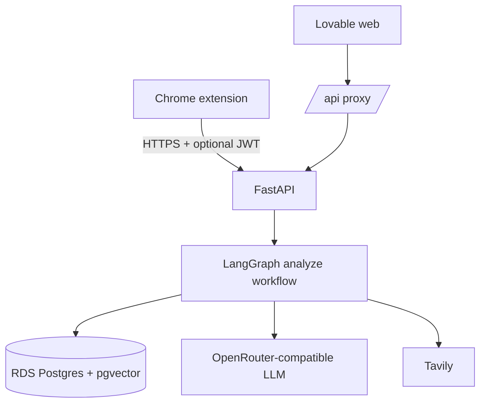
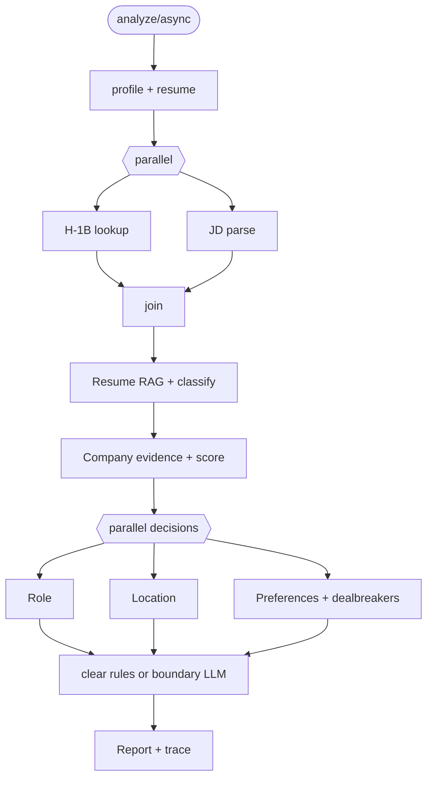

# JobLens architecture

This document describes the deployed system. Scoring behavior belongs only in
[SCORING_STANDARD.md](SCORING_STANDARD.md).

## Repositories and surfaces

| Surface | Repository | Runtime |
|---|---|---|
| Chrome extension | `joblens/extension` | LinkedIn content script + MV3 service worker |
| Web | `vision-job-glow` | Lovable/TanStack app with `/api/*` proxy |
| API | `joblens/backend` | FastAPI container on EC2 |
| Data | `joblens/db`, `data-pipeline` | RDS Postgres + pgvector |

Live web: https://job-lens-main.lovable.app
Live API: https://3-128-164-130.sslip.io



## Input paths

The API has one analyze contract; only collection differs:

| Client | JD source |
|---|---|
| Extension | LinkedIn Voyager response, then JSON-LD/DOM fallbacks |
| Web URL | backend URL fetch; LinkedIn may block or truncate it |
| Web manual | user-pasted posting text |

Both clients normalize company, title, and location before analysis. Different
source text can legitimately change evidence and prose; cross-surface stability
is evaluated by normalized inputs and dimension bands.

Analyze request:

```json
{
  "jd_text": "required",
  "company": "optional",
  "title": "optional",
  "job_url": "optional",
  "job_location": "optional",
  "resume_text": "optional override"
}
```

## Authentication and profile ownership

JobLens email/password authentication is separate from LinkedIn login.

1. Web login stores a JWT in local storage.
2. `extension/sync-auth.js` copies it to Chrome storage.
3. Both clients send the JWT to the API.
4. The API loads that user's Profile and primary Resume from Postgres.

Logged-in profiles are DB-authoritative. The golden YAML is used for guest,
development, and evaluation flows; it does not silently overwrite an account.

## Analyze workflow



The dimensions produce independently validated records. Failure in one
dimension triggers only that dimension's fallback. The Final Verdict consumes
validated outputs and cannot rewrite them.

Main code:

- `backend/app/graph/` — workflow and assembly
- `backend/app/tools/analyze_tools.py` — pipeline operations
- `backend/app/tools/independent_decisions.py` — parallel decisions
- `backend/app/tools/recommendation*.py` — final verdict
- `backend/app/schemas/` — Profile and Report contracts

## H-1B and Company evidence

H-1B matching runs only on the backend against Postgres. The extension calls
`/sponsorship/lookup` for its fast pill and receives the same resolver used by
full analysis.

Company fit is separate from sponsorship. Tavily discovers sources; the scorer
compares evidence with the current user's Company preferences. JD marketing
copy is not Company evidence.

## Async jobs and traces

`POST /analyze/async` returns `job_id` and `run_id`; clients poll
`GET /analyze/jobs/{job_id}`. Job state is in memory and expires. Completed
reports are returned to clients; optional traces are written to
`logs/traces/{run_id}.json`.

Raw decision records and trace endpoints are restricted to the configured test
account. Other responses are stripped server-side.

## Shared rendering

`shared/report-view.js`, `shared/analyze-client.js`, and `design/` are synced to
both clients with:

```bash
./scripts/sync-shared-ui.sh
./scripts/sync-design-tokens.sh
```

Do not build a second report renderer in a client.

## Persistence

Stored in Postgres:

- DOL/LCA employer identity and filing aggregates
- accounts and password hashes
- Profile JSON
- primary Resume text
- Resume chunks and embeddings

Not stored in Postgres:

- job-analysis history
- parsed JD artifacts
- past scores and verdicts

See [DATABASE.md](DATABASE.md).

## Deployment boundaries

| Change | Required action |
|---|---|
| Backend | push `joblens`, run `deploy/ec2-redeploy.sh` on EC2 |
| Extension | reload unpacked extension |
| Shared report | run sync scripts, commit both repos, publish Lovable |
| Web-only | push `vision-job-glow`, publish in Lovable |

## Related documents

- [SCORING_STANDARD.md](SCORING_STANDARD.md)
- [REPORT_SCHEMA.md](REPORT_SCHEMA.md)
- [DATABASE.md](DATABASE.md)
- [MULTI_SURFACE.md](MULTI_SURFACE.md)
- [CODEX_HANDOFF.md](CODEX_HANDOFF.md)
