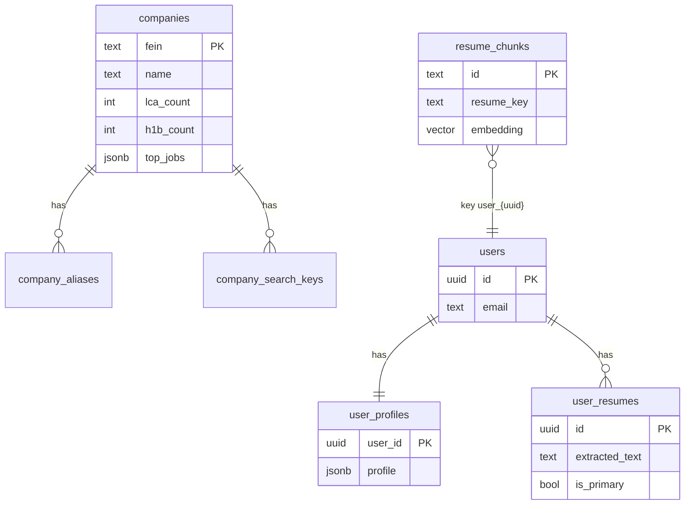

# Database (RDS Postgres)

JobLens uses one Postgres database on AWS RDS (`joblens-db`). This page explains **what is persisted** vs **what is computed on each analyze**.

---

## Tables overview

---

## 1. H-1B employer index (static)

Loaded by `data-pipeline/load_to_postgres.py` from
`data/h1b/employers.json.gz`, generated from DOL/LCA data.

| Table | Purpose |
|-------|---------|
| `companies` | One row per FEIN: legal name, city/state, NAICS, LCA/H-1B counts, `top_jobs` JSON |
| `company_aliases` | Alternate names → FEIN |
| `company_search_keys` | Normalized search keys → FEIN |

**Used when:** `POST /sponsorship/lookup` or analyze pipeline calls `search_h1b_company()`.

**Not stored here:** per-request match results, sponsorship “likelihood” history.

Schema: `db/schema.sql`

---

## 2. User accounts

| Table | Purpose |
|-------|---------|
| `users` | Email + password hash |
| `user_profiles` | Full profile JSON (tracks, preferences, dealbreakers, locations, …) |
| `user_resumes` | Uploaded resume **plain text** + filename; one `is_primary` row per user |

**Used when:** logged-in `/analyze` — backend loads profile + primary resume automatically.

Schema: `db/auth_schema.sql`

---

## 3. Resume vectors (for matching)

| Table | Purpose |
|-------|---------|
| `resume_chunks` | Resume split into sections; each row has `content` + `embedding vector(1536)` |

**Key:** `resume_key` — e.g. `user_<uuid>` after `/resume/upload`, or `resume_<hash>` for dev/golden.

**Used when:** `score_resume_against_jd` retrieves nearest chunks per JD requirement.

**Not stored:** Strong/Partial/Gaps lists, fit_ratio, or per-requirement labels from past jobs.

Schema: `deploy/rds-init.sql` (includes `CREATE EXTENSION vector`)

---

## What is NOT in Postgres

| Data | Where it goes |
|------|----------------|
| Full analyze Report JSON | Returned to client; optional debug file `logs/traces/{run_id}.json` on EC2 |
| Async job status | In-memory ~1 hour (`backend/app/analyze_jobs.py`) |
| Parsed JD requirements | Built during analyze, not saved |
| Company/location tier scores | Computed during analyze, not saved |
| “User analyzed job X on date Y” history | Not implemented (no `job_analyses` table yet) |

---

## Extensions required

- `vector` — pgvector for `resume_chunks.embedding`
- `pgcrypto` — user IDs / auth (`auth_schema.sql`)

---

## Local vs production

| | Local (`docker compose`) | Production (EC2) |
|--|--------------------------|------------------|
| Host | `localhost:5432` | RDS endpoint in Secrets Manager |
| Migrations | `deploy/rds-init.sql`, `db/auth_schema.sql` via `ec2-redeploy.sh` | Same |

Credentials: AWS Secrets Manager `joblens/rds`, `joblens/app` — see `deploy/aws-resources.md`.
