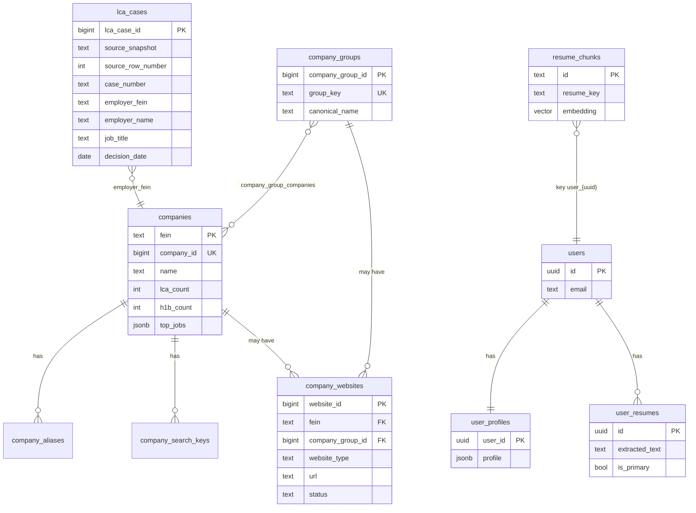

# Database (RDS Postgres)

JobLens uses one Postgres database on AWS RDS (`joblens-db`). This page explains **what is persisted** vs **what is computed on each analyze**.

---

## Tables overview



---

## 1. H-1B / LCA company data

Production H-1B lookups read Postgres, not JSON files. There are two loaders:

- `data-pipeline/load_lca_excel_to_postgres.py` loads the cleaned canonical Excel workbook into `lca_cases`, then derives the FEIN-level lookup tables.
- `data-pipeline/load_to_postgres.py` is the legacy/lightweight loader from `data/h1b/employers.json.gz`; it remains useful for quick rebuilds of the existing sponsorship index, but it is no longer the preferred full-data path.

| Table | Purpose |
|-------|---------|
| `lca_cases` | Full cleaned Excel fact table. One row per LCA/H-1B filing. `CASE_NUMBER` is kept for tracing but is not unique. |
| `companies` | One row per FEIN legal entity. This is the existing sponsorship lookup table and remains keyed by `fein`. |
| `company_aliases` | Alternate legal names, DBA names, spelling/case variants → FEIN. |
| `company_search_keys` | Normalized search keys → FEIN for entity resolution. |
| `company_groups` | Optional brand/group/family layer for cases where several FEIN legal entities should roll up to one user-facing company group. |
| `company_group_companies` | Many-to-many mapping between `company_groups` and FEIN entities in `companies`. |
| `company_websites` | Corporate/careers URLs for either a FEIN legal entity, a broader company group, or both. Future JobPush crawling starts here. |

**Used when:** `POST /sponsorship/lookup` or analyze pipeline calls `search_h1b_company()`.

**Current sponsorship dependency:** the backend reads only `companies`, `company_aliases`, and `company_search_keys`. Existing fields used by sponsorship (`fein`, `name`, `naics_code`, `naics_sector`, `city`, `state`, `lca_count`, `h1b_count`, `certified_count`, `top_jobs`) are preserved.

**JobPush dependency:** future website/career crawling should use `company_websites` and may resolve through either `companies.fein` or `company_groups.company_group_id`.

**Not stored here:** per-request match results, sponsorship “likelihood” history, crawled job postings, or user application history.

Schema: `db/schema.sql`

### Company identity levels

| Level | Table | Meaning | Cardinality |
|-------|-------|---------|-------------|
| Filing row | `lca_cases` | One LCA/H-1B application from the cleaned Excel workbook. | Many rows per FEIN |
| Legal entity | `companies` | FEIN-deduped employer entity. | One row per FEIN |
| Alias/name | `company_aliases` | Alternate names or DBA strings for one FEIN. | Many aliases per FEIN |
| Brand/group | `company_groups` | Optional umbrella such as a parent brand, university system, hospital system, or company family. | Many-to-many with FEINs |
| Website | `company_websites` | Corporate or careers URL. | Can point to a FEIN, a group, or both |

The data intentionally does **not** assume one-to-one relationships between FEIN, brand, and website. Real data includes:

- one FEIN with many names/DBAs;
- several FEINs under one brand/group;
- one FEIN that may need to be associated with more than one brand/website context.

### JSON role

`data/h1b/employers.json.gz` is not loaded by the extension or backend at runtime. Runtime calls go:

```text
Chrome/Web client -> FastAPI -> RDS Postgres
```

The JSON file is a historical/legacy seed artifact:

```text
raw/cleaned LCA data -> employer index JSON -> Postgres lookup tables
```

The canonical full-data path for new work is now:

```text
cleaned LCA Excel -> lca_cases -> derived companies/search tables -> RDS
```

---

## 2. User accounts

| Table | Purpose |
|-------|---------|
| `users` | Email + password hash |
| `user_profiles` | Full profile JSON (tracks, preferences, dealbreakers, locations, …) |
| `user_resumes` | Uploaded resume **plain text** + filename; one `is_primary` row per user |

**Used when:** logged-in `/analyze` — backend loads profile + primary resume automatically.

Schema: `db/auth_schema.sql`

---

## 3. Resume vectors (for matching)

| Table | Purpose |
|-------|---------|
| `resume_chunks` | Resume split into sections; each row has `content` + `embedding vector(1536)` |

**Key:** `resume_key` — e.g. `user_<uuid>` after `/resume/upload`, or `resume_<hash>` for dev/golden.

**Used when:** `score_resume_against_jd` retrieves nearest chunks per JD requirement.

**Not stored:** Strong/Partial/Gaps lists, fit_ratio, or per-requirement labels from past jobs.

Schema: `deploy/rds-init.sql` (includes `CREATE EXTENSION vector`)

---

## What is NOT in Postgres

| Data | Where it goes |
|------|----------------|
| Full analyze Report JSON | Returned to client; optional debug file `logs/traces/{run_id}.json` on EC2 |
| Async job status | In-memory ~1 hour (`backend/app/analyze_jobs.py`) |
| Parsed JD requirements | Built during analyze, not saved |
| Company/location tier scores | Computed during analyze, not saved |
| “User analyzed job X on date Y” history | Not implemented (no `job_analyses` table yet) |

---

## Extensions required

- `vector` — pgvector for `resume_chunks.embedding`
- `pgcrypto` — user IDs / auth (`auth_schema.sql`)

---

## Local vs production

| | Local (`docker compose`) | Production (EC2) |
|--|--------------------------|------------------|
| Host | `localhost:5432` | RDS endpoint in Secrets Manager |
| Migrations | `deploy/rds-init.sql`, `db/auth_schema.sql` via `ec2-redeploy.sh` | Same |

Credentials: AWS Secrets Manager `joblens/rds`, `joblens/app` — see `deploy/aws-resources.md`.
