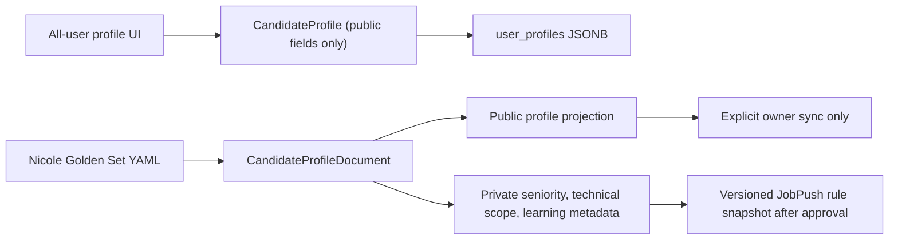
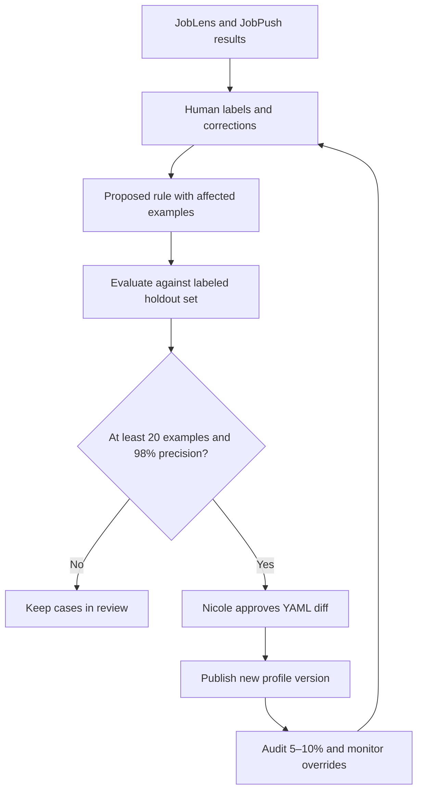

# Shared job-search profile

The canonical human-editable source is
`evals/golden_set/candidate_profile.yaml`. It describes job-search intent,
which is separate from resume evidence.

JobLens uses the profile when matching a specific job. JobPush must consume a
versioned, validated snapshot of the same profile when classifying titles from
career sites. The YAML is the source of truth; do not maintain a second
hand-edited copy in JobPush.

## Public user profile versus owner document

The shared YAML is Nicole's personal Golden Set document. It is not the
onboarding template for every user.

`CandidateProfile` keeps the original ordinary-user format: tracks, avoid
tracks, locations, preferences, dealbreakers, company preferences, technical
penalties, alumni schools, and sponsorship constraints.

`CandidateProfileDocument` is used only to validate the owner YAML. It adds
profile status/version, seniority policy, technical scope, learning policy, and
open questions. Those internal fields are stripped before `/me/profile` data is
returned or saved, so they do not appear in normal onboarding or user JSON.

## What belongs in the profile

- target role families and positive examples;
- avoid role families and negative examples;
- seniority range and ambiguous seniority words;
- target, excluded, and conditional technical domains;
- location, sponsorship, employment, and company constraints;
- explicit preferences and dealbreakers;
- unresolved questions that must not become active rules;
- learning thresholds and review cadence.

SOC mappings are supporting evidence, not the profile. A SOC family can contain
both feasible and infeasible detailed jobs. Resume-fit scoring is also separate:
a target job can still be a poor resume match.

## Precedence

1. Exact human label for a normalized title.
2. Explicit active hard exclusion or seniority rule.
3. Explicit target/conditional-domain rule.
4. SOC mapping and title similarity.
5. Unresolved cases remain `review`.

`profile_status: draft` means new broad rules are documentation only. Change it
to `active` only after resolving the listed questions and running the labeled
evaluation set.

For a logged-in account, the database profile is authoritative. Editing the
YAML does not silently overwrite it. After an active profile is approved,
explicitly run `backend/scripts/seed_owner_account.py` in the deployed backend
to synchronize the owner account; that operation also synchronizes the golden
resume, so review the command scope before running it.

## Safe learning loop

The system must not silently rewrite the profile from its own predictions.

1. Collect exact human labels and retain their reasons.
2. Cluster false positives/negatives into candidate rules.
3. Evaluate each candidate against a fixed holdout set.
4. Propose a YAML diff with affected examples and estimated precision/coverage.
5. Require human approval before activation.
6. Record profile version on every JobLens decision and JobPush classification.
7. Audit the highest-volume unresolved titles weekly during initial rollout;
   move to monthly after error and drift rates stabilize.

An automatic rule needs at least the configured example count and precision.
Even after activation, sample 5–10% for continuing audit. Manual labels always
override rules and are never overwritten by a refresh.

## Dates and review plan

| Date | Event |
|---|---|
| 2026-06-23 | 171 HIGH JobPush titles labeled and imported: 37 target, 133 non-target, 1 review |
| 2026-06-23 | Owner YAML draft expanded with seniority and technical boundaries |
| 2026-06-27 | Senior/Sr updated from SDE-only exclusion to global hard exclusion for Nicole's current search |
| 2026-06-23 | Owner-only document fields isolated from ordinary-user profile APIs |
| 2026-06-23 | All owner open questions resolved: QA/cloud/cybersecurity and analytics data science included; Associate, up to 10 years, contract/temp/part-time/travel accepted |
| 2026-06-30 | First title-rule audit: review false-positive clusters and run the holdout report |
| 2026-07-07 | Second weekly audit and drift comparison |
| 2026-07-23 | Monthly readiness review: decide whether draft can become active |

Weekly review continues while the profile is draft or the override rate is
unstable. After two stable monthly reviews, the default cadence may move to
monthly while keeping immediate review for critical regressions.

The questions are resolved, but the profile intentionally remains `draft`
until the labeled holdout evaluation passes. Resolving a question documents
intent; it does not silently activate a new production rule or modify an
ordinary user's profile.

## Career-site discovery learning

Website discovery uses the same pattern but separate evidence:

- measure precision by source type, candidate rank, domain, and company tier;
- automatically verify only narrow structured-ATS segments with enough reviewed
  examples and at least the configured precision;
- keep generic HTML, entity conflicts, and ambiguous brands in human review;
- retain a small audit sample from auto-verified sites;
- disable a rule after repeated parse failures, wrong-company evidence, or
  country-scope regression.

## Publication contract for JobPush

After the draft is approved, publish a compiled snapshot containing only fields
needed for title classification. The snapshot must include:

- `profile_version` and source Git commit;
- active seniority and technical-domain rules;
- normalized positive/negative examples;
- checksum and publication timestamp.

JobPush stores the snapshot version with every rule decision. If publication or
validation fails, JobPush keeps the last valid version and routes new ambiguous
titles to review rather than guessing.
